

  

# Medusse IoT — Public Showcase / Escaparate público

## ES — Visión general
**Medusse IoT** es un ecosistema completo de monitorización ambiental (IoT + microservicios). Integra simulación de sensores, canalización de datos en tiempo real y visualización profesional.

**Demo pública (solo lectura):** Próximamente.  
**Grafana:** No se expone públicamente (solo capturas).

## EN — Overview
**Medusse IoT** is a full environmental monitoring ecosystem (IoT + microservices). It combines sensor simulation, real-time data pipeline, and professional visualization.

**Public read-only demo:** Coming soon.  
**Grafana:** Not publicly exposed (screenshots only).

---

## ES — Qué encontrarás aquí
- Descripción del proyecto y alcance
- Diagramas de arquitectura y flujo de datos
- Capturas (web, dashboard, grafana, app)
- Enlaces públicos (cuando la demo esté online)

## EN — What you will find here
- Project overview and scope
- Architecture and data-flow diagrams
- Screenshots (web, dashboard, grafana, app)
- Public links (once the demo is online)

## ES — Qué NO encontrarás aquí
El **código fuente completo** y los **archivos de despliegue** no son públicos todavía porque el proyecto está pensado para **distribución futura**.

## EN — What you will NOT find here
The **full source code** and **deployment stack** are not public yet, because the project is intended for **future distribution**.

---

## Screenshots / Capturas

### Web
1) `web1.png` (más importante)
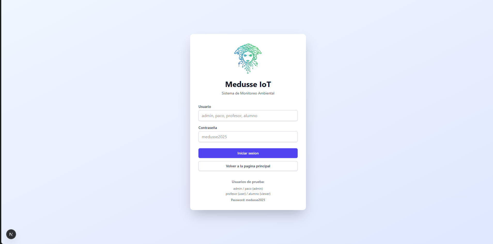

2) `web2.png`
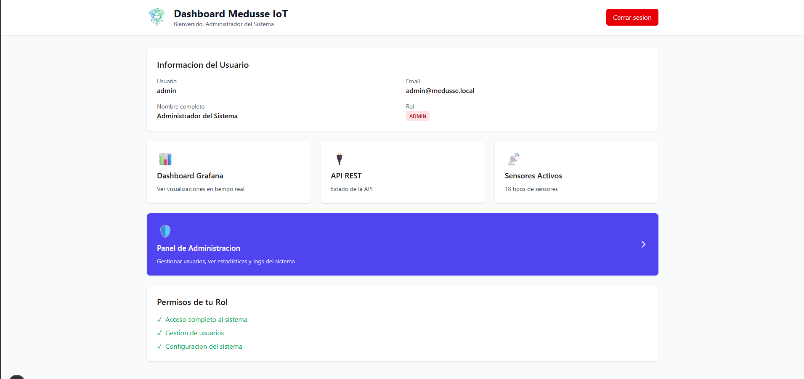

3) `web3.png`
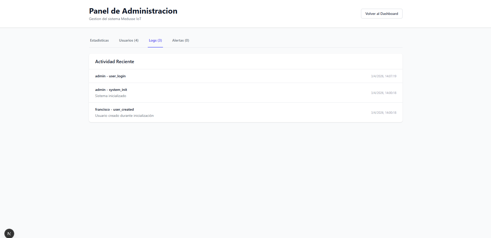

4) `web4.png`
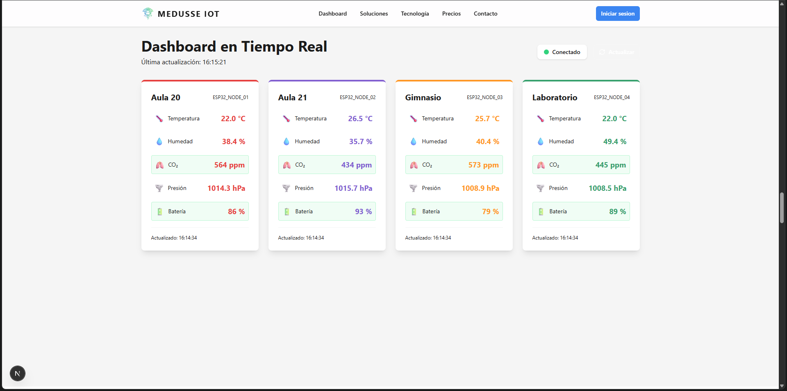

### Dashboards (Grafana / Web)
1) `Dash1.png` (más importante)
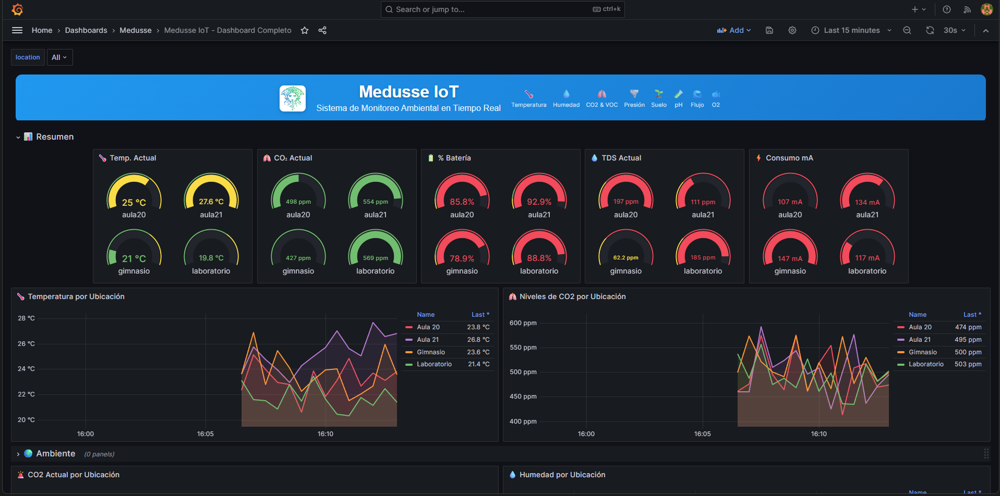

2) `Dash2.png`
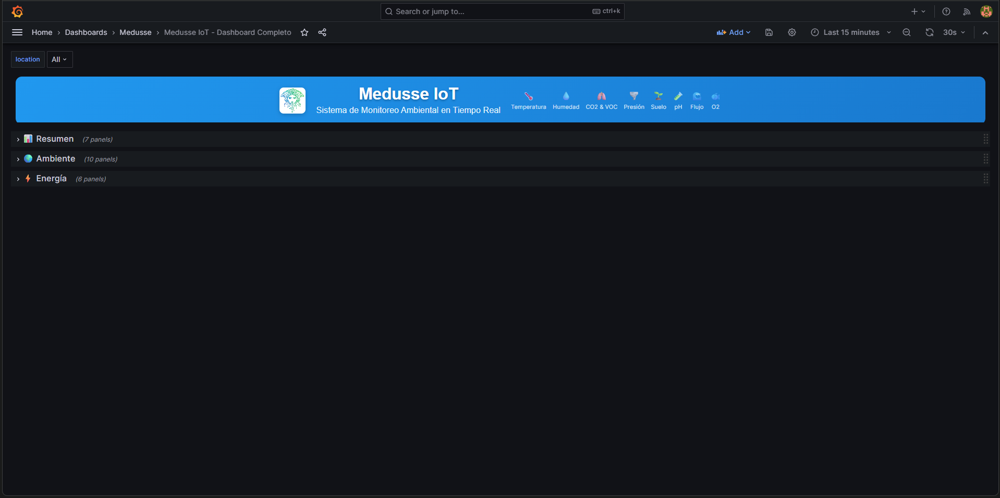

3) `Dash3.png`
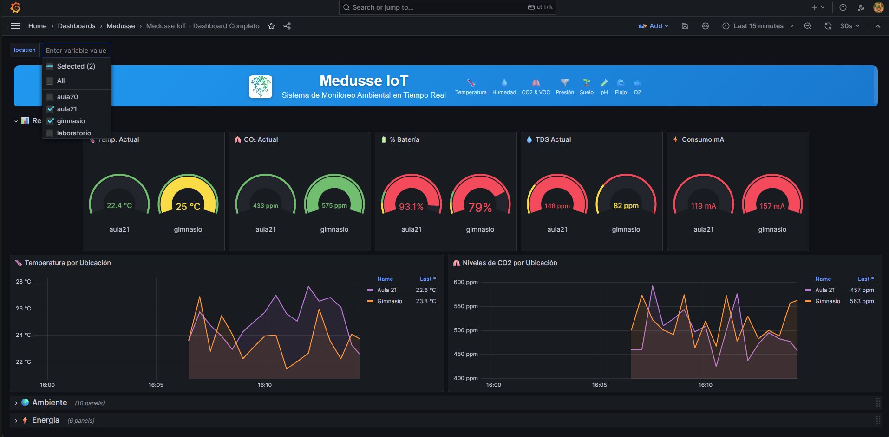

### Grafana
1) `Graf1.png` (más importante)
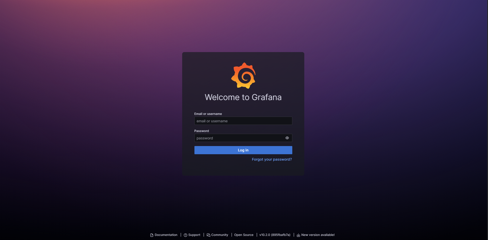

2) `Graf2.png`
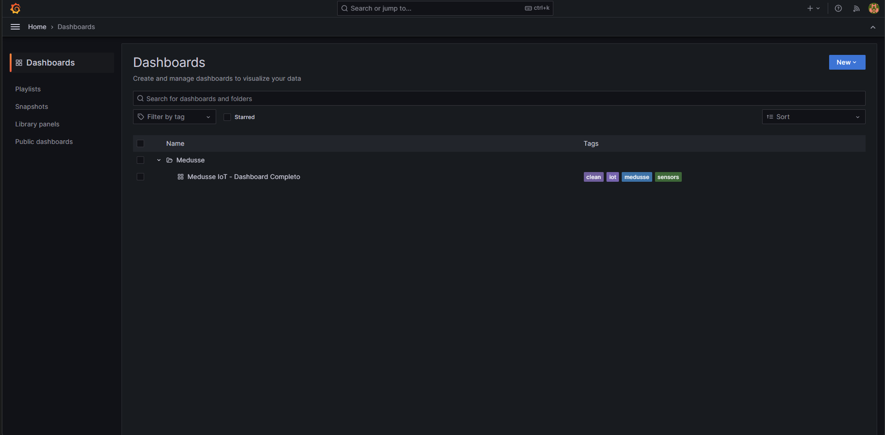

### Mobile app (Flutter)
1) `app1.jpg` (más importante)
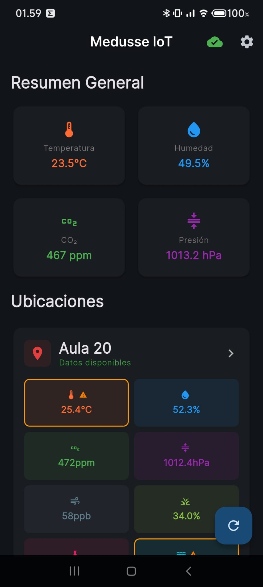

2) `app2.jpg`
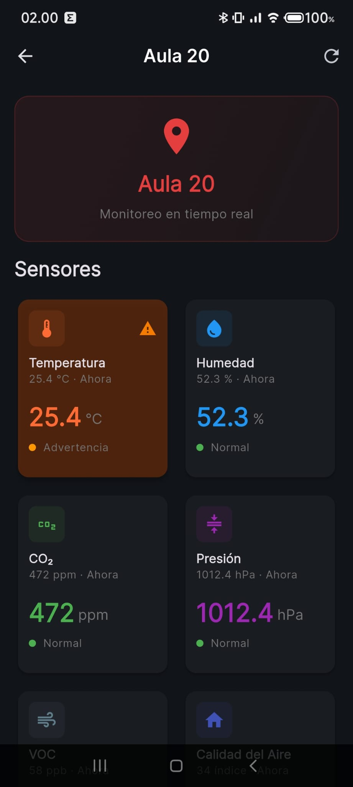

3) `app3.jpg`
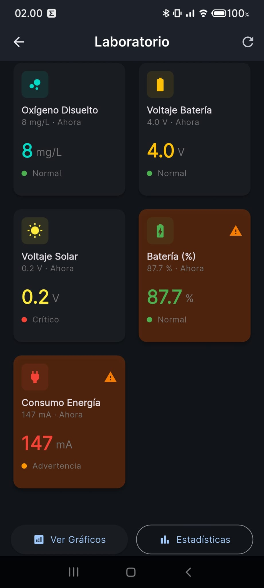

4) `app4.jpg`
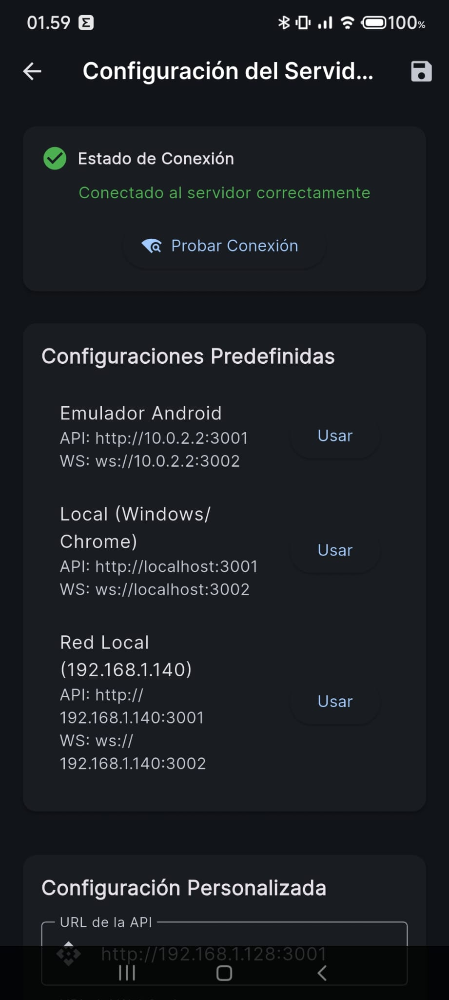

---

## Docs
- `docs/ARCHITECTURE.md`
- `docs/DATA_FLOW.md`
- `docs/STACK.md`
- `docs/FEATURES.md`

---

## Contact / Contacto
Francisco Manuel López Alarte  
Email: pacoaldev@gmail.com
