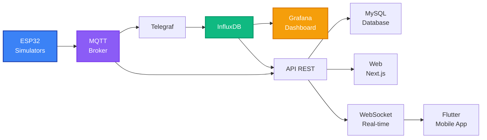

<p align="center">
  
</p>

# Proyecto Medusse IoT

**Ecosistema IoT completo y profesional** para monitoreo ambiental con ESP32, MQTT, InfluxDB, Grafana, API REST, Web Next.js y App móvil Flutter. **Instalación automática en un solo clic.**

## 📋 Descripción

**Sistema IoT de nivel profesional** que incluye simulación realista de sensores ESP32, pipeline de datos moderno, dashboard web con branding personalizado, API REST robusta, aplicación web Next.js y aplicación móvil Flutter multiplataforma. **18 tipos de sensores monitoreados** incluyendo ambientales, calidad de agua, energía solar y gestión de batería. **Completamente automatizado** con scripts de instalación y verificación. Sistema preparado para migración directa a hardware real con comunicación LoRa Mesh.

## 🏗️ Arquitectura Completa


```mermaid
flowchart LR
    ESP[ESP32<br/>Simulators] --> MQTT[MQTT<br/>Broker]
    MQTT --> TEL[Telegraf]
    TEL --> INFLUX[InfluxDB]
    INFLUX --> GRAF[Grafana<br/>Dashboard]
    MQTT --> API[API REST]
    INFLUX --> API
    API --> MYSQL[MySQL<br/>Database]
    API --> WEB[Web<br/>Next.js]
    API --> WS[WebSocket<br/>Real-time]
    WS --> FLUTTER[Flutter<br/>Mobile App]
    
    style ESP fill:#3b82f6,stroke:#1e40af,stroke-width:2px,color:#fff
    style MQTT fill:#8b5cf6,stroke:#7c3aed,stroke-width:2px,color:#fff
    style INFLUX fill:#10b981,stroke:#059669,stroke-width:2px,color:#fff
    style GRAF fill:#f59e0b,stroke:#d97706,stroke-width:2px,color:#fff
```

## 📁 Estructura del Proyecto

```
proyecto-medusse/
├── arduino/                    # Simuladores y firmware ESP32
│   ├── medusse_simulator.py   # Simulador principal (4 ubicaciones, 18 sensores)
│   ├── src/                   # Código ESP32 real (preparado para LoRa)
│   └── node2/                 # Configuración nodo secundario
├── docker/                    # Stack completo Docker
│   ├── docker-compose.yml     # 5 servicios: MQTT, InfluxDB, Grafana, Telegraf, MySQL
│   ├── grafana/              # Configuración y dashboards
│   │   ├── dashboards/       # Dashboard medusse-clean.json
│   │   └── provisioning/     # Configuración automática
│   ├── telegraf/             # Pipeline de datos MQTT→InfluxDB
│   │   └── telegraf.conf     # Configuración completa
│   ├── mosquitto/            # Broker MQTT 2.0
│   │   └── mosquitto.conf    # Configuración con WebSocket
│   ├── mysql/                # Base de datos MySQL 8.0
│   │   ├── init/             # Scripts SQL de inicialización
│   │   │   ├── 01-schema.sql           # 9 tablas
│   │   │   ├── 02-seed-data.sql        # Datos iniciales
│   │   │   └── 03-stored-procedures.sql # 10 procedimientos
│   │   └── DATABASE_DOCUMENTATION.md    # Documentación técnica
│   └── influxdb/             # Configuración InfluxDB
├── api/                       # API REST Node.js + Express
│   ├── server.js             # Servidor principal (1075 líneas)
│   ├── db.js                 # Conexión MySQL
│   ├── auth.js               # Lógica de autenticación
│   ├── auth-routes.js        # Rutas de autenticación
│   ├── admin-routes.js       # Rutas de administración
│   ├── package.json          # Dependencias Node.js
│   ├── .env                  # Variables de entorno
│   └── README.md             # Documentación API completa
├── web/                       # Aplicación Web Next.js 16
│   ├── src/                  # Código fuente TypeScript
│   │   ├── app/             # App Router de Next.js
│   │   │   ├── page.tsx     # Página principal
│   │   │   ├── login/       # Página de login
│   │   │   └── dashboard/   # Dashboard protegido
│   │   ├── components/      # Componentes React
│   │   │   ├── layout/      # Header, Footer
│   │   │   ├── sections/    # Hero sections
│   │   │   └── ui/          # Componentes UI
│   │   ├── lib/             # Utilidades
│   │   │   ├── api.ts       # Cliente API (400+ líneas)
│   │   │   └── data.ts      # Datos estáticos
│   │   └── hooks/           # Custom hooks
│   │       └── use-websocket.ts # Hook WebSocket
│   ├── public/              # Recursos estáticos
│   ├── tailwind.config.ts   # Configuración Tailwind
│   └── package.json         # Dependencias
├── medusse_app/              # Aplicación Móvil Flutter
│   ├── lib/                 # Código fuente Dart
│   │   ├── main.dart        # Entry point
│   │   ├── models/          # Modelos de datos
│   │   ├── services/        # Servicios (API, WebSocket)
│   │   ├── providers/       # Providers de estado
│   │   ├── screens/         # Pantallas (Home, Detail, Charts)
│   │   └── widgets/         # Widgets reutilizables
│   ├── pubspec.yaml         # Dependencias Flutter
│   └── README.md            # Documentación Flutter
├── documentacion/           # 📖 Documentación completa del proyecto
│   ├── DOCUMENTACION_RETOS.md          # 16 retos detallados (2792 líneas)
│   ├── DOCUMENTACION_GENERAL_RETOS.md  # Resumen general (1224 líneas)
│   ├── README_DOCUMENTACION.md         # Guía de documentación
│   ├── RESUMEN_ENTREGA_PROFESOR.md     # Resumen ejecutivo
│   ├── RETO_1_SOSTENIBILIDAD.md        # Reto 1 completo
│   ├── RETO_6_PLAN_EMPRESA.md          # Plan de empresa
│   ├── INSTALACION.md                  # Guías de instalación
│   ├── MIGRACION.md                    # Migración a LoRa Mesh
│   ├── VERCEL_DEPLOYMENT.md            # Deployment en Vercel
│   └── LINKS.md                        # Enlaces web
├── tools_linux/             # Herramientas para Linux/Lliurex
│   ├── setup_lliurex.sh     # 🐧 Instalación para Lliurex
│   ├── ejecutar_lliurex.sh  # 🐧 Ejecutar en Lliurex
│   ├── verificar_lliurex.sh # 🐧 Verificar en Lliurex
│   └── detener_lliurex.sh   # 🐧 Detener en Lliurex
├── Scripts Windows (raíz):  # Scripts de automatización
│   ├── medusse.bat          # 🎯 Menú principal unificado
│   ├── sistema_completo.bat # 🚀 Sistema completo
│   ├── iniciar_api.bat      # 🔌 API REST + WebSocket
│   ├── ejecutar_flutter.bat # 📱 App móvil Flutter
│   ├── ejecutar_web.bat     # 🌐 Web Next.js
│   ├── verificar.bat        # 🔍 Verificación completa
│   ├── setup_rapido.bat     # ⚡ Setup rápido
│   └── detener.bat          # 🛑 Detener servicios
├── CHANGELOG.md             # Historial de cambios (1340+ líneas)
├── README.md                # Esta documentación
├── requirements.txt         # Dependencias Python
└── Medusse.code-workspace   # Workspace de VS Code
```

## 🚀 Características

### 🤖 Automatización Avanzada
- **Instalación automática** de Docker y dependencias
- **Scripts de verificación** con diagnósticos inteligentes
- **Setup completo** en un solo comando
- **Detección automática** de problemas y soluciones

### 🏗️ Sistema IoT Completo
- **Simulador de sensores** con datos realistas por ubicación
- **Gateway MQTT avanzado** con múltiples fuentes
- **Base de datos InfluxDB v2** con configuración persistente
- **Dashboard Grafana profesional** con filas colapsables, filtros avanzados y branding personalizado
- **API REST robusta** con caché inteligente
- **App móvil Flutter** multiplataforma con Material Design 3

### ⚡ Performance Optimizado
- **Caché automático** en API (30 segundos)
- **Pipeline sin pérdidas** con retry automático
- **Agregación inteligente** de datos (30s)
- **Networking Docker** optimizado
- **18 sensores monitoreados** simultáneamente

### Sensores Monitoreados
- 🌡️ **Temperatura** (°C)
- 💧 **Humedad** (%)
- 🌬️ **CO₂** (ppm)
- 📊 **Presión atmosférica** (hPa)
- 🌿 **VOC** (Compuestos Orgánicos Volátiles - ppb)
- 🏠 **IAQ** (Calidad del Aire Interior - índice)
- 🌱 **Humedad del suelo** (%)
- ⚗️ **pH** (nivel de pH del agua)
- 💦 **Flujo de agua** (L/min)
- 🧪 **TDS** (Sólidos Disueltos Totales - ppm)
- 🐟 **Oxígeno disuelto** (mg/L)
- 🔋 **Voltaje de batería** (V)
- ☀️ **Voltaje solar** (V)
- 🔋 **Porcentaje de batería** (%)
- ⚡ **Consumo de energía** (mA)
- 🔌 **Estado de carga** (booleano)
- 🌙 **Modo bajo consumo** (booleano)
- 🔄 **Contador de wake-ups** (conteo)

### Ubicaciones
- 📍 **Aula 20**
- 📍 **Aula 21**
- 📍 **Gimnasio**
- 📍 **Laboratorio**

### 📱 Aplicación Móvil Avanzada
- **Flutter app** con Material Design 3 y Google Fonts
- **3 pantallas completas:** Home, Detalle por ubicación, Gráficos históricos
- **WebSocket en tiempo real** para updates automáticos
- **Gráficos interactivos** con fl_chart y animaciones
- **Sistema de alertas** inteligente por umbrales
- **Provider pattern** para gestión de estado reactiva
- **Multiplataforma:** Windows, Web, Android

## 🎉 Estado: ECOSISTEMA COMPLETO ✅

### ✅ Funcionalidades Implementadas

**🤖 Automatización Total:**
- **Instalación en un clic** para equipos nuevos (`instalar_proyecto.bat`)
- **Setup rápido** para equipos con Docker (`setup_rapido.bat`)
- **Verificación automática** con diagnósticos (`verificar.bat`)
- **Ecosistema completo** con monitoreo (`sistema_completo.bat`)

**🏗️ Core IoT System:**
- **4 ubicaciones monitoreadas:** Aula 20 (22°C), Aula 21 (24°C), Gimnasio (23°C), Laboratorio (21°C)
- **18 tipos de sensores:** Temperatura, Humedad, CO2, Presión, VOC, IAQ, Humedad suelo, pH, Flujo agua, TDS, Oxígeno disuelto, Voltaje batería, Voltaje solar, Porcentaje batería, Consumo energía, Estado carga, Modo bajo consumo, Wake count
- **Dashboard Grafana profesional** con filas colapsables, sección de resumen, filtros avanzados y branding personalizado
- **Pipeline optimizado** MQTT → Telegraf → InfluxDB → Grafana
- **Simulador inteligente** con datos realistas por ubicación

**🔌 API REST & Mobile Avanzados:**
- **API REST Node.js** con 6 endpoints y caché inteligente
- **WebSocket Server** para streaming en tiempo real (puerto 3002)
- **App Flutter completa** con 3 pantallas y gráficos interactivos
- **Sistema de alertas** automático por umbrales de CO2
- **Arquitectura híbrida** HTTP + WebSocket para mejor UX

**⚙️ Infraestructura Productiva:**
- **4 contenedores Docker** con networking interno optimizado
- **Volúmenes persistentes** para todos los servicios
- **Configuración InfluxDB v2** con tokens y organización
- **MQTT Mosquitto 2.0** con WebSocket habilitado
- **Restart policies** automáticas para alta disponibilidad

## 🚀 Inicio Ultra Rápido

### 🤖 Instalación Automática (Recomendada)

#### Windows

**Para equipos nuevos (instala Docker automáticamente):**
```cmd
instalar_proyecto.bat
```
*Instala Docker Desktop, Python, dependencias y configura todo automáticamente.*

**Para equipos con Docker ya instalado:**
```cmd
setup_rapido.bat
```
*Setup completo en menos de 2 minutos.*

#### Linux / Lliurex

**Instalación completa:**
```bash
chmod +x setup_lliurex.sh
./setup_lliurex.sh
```
*Maneja permisos de Docker automáticamente. Ver INSTALACION_LLIUREX.md para más detalles.*

### ⚡ Ejecución del Sistema

#### Windows

**Menú Principal Unificado (Recomendado):**
```cmd
medusse.bat                # Menú interactivo con todas las opciones
```

**O ejecutar directamente:**
```cmd
sistema_completo.bat       # Sistema completo
verificar.bat              # Verificación completa
```

#### Linux / Lliurex

**1. Verificar Sistema:**
```bash
./verificar_lliurex.sh     # Verificación completa
```

**2. Ejecutar Sistema Completo:**
```bash
./ejecutar_lliurex.sh      # Dashboard + API + Simulador
```

**3. Detener Sistema:**
```bash
./detener_lliurex.sh       # Detener todos los servicios
```

### Acceso a Interfaces

| Servicio | URL | Credenciales |
|----------|-----|--------------|
| **Grafana Dashboard** | http://localhost:3000 | admin / medusse2025 |
| **API REST** | http://localhost:3001 | - |
| **InfluxDB** | http://localhost:8086 | admin / medusse2025 |
| **App Flutter** | Ejecutar con script | - |

## 📊 Servicios y Tecnologías

| Servicio        | Puerto | Descripción                        | Versión |
| --------------- | ------ | ---------------------------------- | ------- |
| **Grafana**     | 3000   | Dashboard profesional con branding personalizado | 10.2.0 |
| **InfluxDB**    | 8086   | Base de datos series temporales con configuración v2 | 2.7 |
| **MQTT Broker** | 1883   | Mosquitto con WebSocket habilitado | 2.0 |
| **WebSocket MQTT** | 9001 | Comunicación web en tiempo real | 2.0 |
| **Telegraf**    | -      | Pipeline optimizado con múltiples consumers | 1.28 |
| **API REST**    | 3001   | Node.js con caché inteligente y 6 endpoints | Express 4.18.2 |
| **WebSocket**   | 3002   | Streaming datos en tiempo real para Flutter | ws 8.14.2 |
| **Flutter App** | -      | App multiplataforma con Material Design 3 | Flutter 3.9+ |

### 🔧 Stack Tecnológico Completo
- **Backend:** Node.js + Express + InfluxDB Client
- **Frontend Móvil:** Flutter + Provider + fl_chart + Google Fonts
- **Base de Datos:** InfluxDB 2.7 (series temporales)
- **Comunicación:** MQTT + WebSocket + HTTP REST
- **Visualización:** Grafana 10.2.0 + Dashboard personalizado
- **Contenedores:** Docker Compose con networking optimizado
- **Automatización:** Scripts batch para Windows y scripts shell para Linux/Lliurex
- **Multiplataforma:** Windows, Linux, Lliurex

## 🛠️ Uso Manual

### Ejecutar Solo el Simulador

```cmd
python arduino/medusse_simulator.py
```

### Iniciar Solo los Servicios Docker

```cmd
docker compose -f docker/docker-compose.yml up -d
```

### Ver Logs de Servicios

```cmd
docker logs medusse_grafana
docker logs medusse_influxdb
docker logs medusse_telegraf
```

## 📈 Dashboard Profesional Personalizado

### 🎨 Diseño y Branding Avanzado
- **Header personalizado** con logo Medusse y gradientes CSS
- **Iconos de sensores** integrados (🌡️💧🫁🌪️)
- **Colores diferenciados** por ubicación:
  - 🔴 **Aula 20:** Rojo (#E53E3E)
  - 🟣 **Aula 21:** Púrpura (#805AD5)
  - 🟠 **Gimnasio:** Naranja (#FF9800)
  - 🟢 **Laboratorio:** Verde (#38A169)

### 📊 Organización Profesional
- **Filas colapsables**: 18 paneles organizados en secciones lógicas expandibles
- **Sección de Resumen**: KPIs principales (temperatura, humedad, CO2) en la parte superior
- **Navegación jerárquica**: Estructura clara con títulos descriptivos
- **Experiencia optimizada**: Reducción del clutter visual

### 🔍 Sistema de Filtrado Avanzado
- **Filtro multi-select por ubicación**: Variables personalizadas para filtrado dinámico
- **Aplicación universal**: Filtro implementado en todos los paneles
- **Consultas Flux optimizadas**: Filtrado por ubicación en tiempo real
- **Interactividad completa**: Cambio instantáneo en todos los gráficos

### 📊 Paneles Optimizados
- **🌡️ Panel Temperatura:** Gráfico de líneas con rangos adaptativos y filtrado
- **🫁 Panel CO2:** Niveles con sistema de alertas por colores (verde/amarillo/rojo)
- **🚨 Gauges CO2:** Valores actuales con umbrales visuales (400-1000+ ppm)
- **💧 Panel Humedad:** Tendencias temporales con promedios móviles
- **🌪️ Panel Presión:** Datos barométricos con variaciones naturales
- **📊 Paneles de Resumen:** KPIs principales con datos en tiempo real

### ⚡ Rendimiento y Actualización
- **Actualización automática:** Cada 30 segundos
- **Agregación inteligente:** Datos promediados cada 30 segundos
- **Caché optimizado:** Sin sobrecarga del sistema
- **Responsive design:** Adaptable a cualquier pantalla
- **Filtrado eficiente:** Consultas optimizadas sin impacto en rendimiento


## 🔧 Configuración Avanzada

### Modificar Frecuencia de Datos

Editar `arduino/medusse_simulator.py`:

```python
time.sleep(15)  # Cambiar intervalo entre ciclos
```

### Agregar Nueva Ubicación

En `medusse_simulator.py`, agregar a la lista `locations`:

```python
{"name": "nueva_aula", "node": "ESP32_NODE_05", "temp_base": 23}
```

### Personalizar Dashboard

- Editar: `docker/grafana/dashboards/medusse-clean.json`
- Reiniciar: `docker compose restart grafana`

## 🐛 Solución de Problemas

### No aparecen datos en Grafana

1. Verificar que el simulador esté corriendo
2. Comprobar logs: `docker logs medusse_telegraf`
3. Verificar conexión MQTT: `docker logs medusse_mosquitto`

### Error "bucket not found"

```cmd
docker compose -f docker/docker-compose.yml down
docker volume prune -f
docker compose -f docker/docker-compose.yml up -d
```

### Servicios no inician

```cmd
verificar.bat
```

## 📝 Desarrollo

### Conectar ESP32 Real

1. Modificar `gateway/medusse_gateway.py`
2. Cambiar source de `simulator` a `serial`
3. Especificar puerto: `--port COM3`

### Agregar Nuevos Sensores

1. Modificar simulador para incluir nuevos campos
2. Actualizar configuración Telegraf
3. Crear nuevos paneles en Grafana

## 📱 App Móvil Flutter

### Características
- **Tiempo real** con WebSocket
- **Gráficos interactivos** con fl_chart
- **Sistema de alertas** inteligente
- **3 pantallas:** Home, Detalle ubicación, Gráficos históricos
- **Multiplataforma:** Windows, Web, Android

### Uso
```cmd
ejecutar_flutter.bat
```

Ver documentación completa en: [medusse_app/README.md](medusse_app/README.md)

## 🌐 API REST Robusta

### 🔌 Endpoints de Datos
| Endpoint | Método | Descripción | Parámetros |
|----------|--------|-------------|------------|
| `/` | GET | Información de la API y endpoints disponibles | - |
| `/health` | GET | Estado de todos los servicios | - |
| `/api/locations` | GET | Lista de ubicaciones disponibles | - |
| `/api/summary` | GET | Resumen general de todas las ubicaciones | - |
| `/api/latest/:location` | GET | Últimos valores por ubicación | `location` |
| `/api/data/:location/:sensor` | GET | Datos históricos con filtros | `location`, `sensor`, `?hours`, `?interval` |
| `/api/stats/:location/:sensor` | GET | Estadísticas (min/max/avg) | `location`, `sensor` |

### 🔐 Endpoints de Autenticación (Reto 9)
| Endpoint | Método | Descripción | Autenticación |
|----------|--------|-------------|---------------|
| `/api/auth/login` | POST | Autenticar usuario y crear sesión | No |
| `/api/auth/logout` | POST | Cerrar sesión activa | Bearer Token |
| `/api/auth/validate` | GET | Validar token de sesión | Bearer Token |
| `/api/auth/profile` | GET | Obtener perfil del usuario | Bearer Token |

### ⚡ WebSocket Real-time
- **Puerto:** `ws://localhost:3002`
- **Datos:** Streaming automático de todas las ubicaciones
- **Formato:** JSON estructurado con timestamps
- **Frecuencia:** Cada 15 segundos (sincronizado con simulador)

### 🚀 Características Avanzadas
- **Caché inteligente:** 30 segundos para optimizar rendimiento
- **CORS habilitado:** Para desarrollo y testing
- **Logging detallado:** Para debugging y monitoreo
- **Manejo de errores:** Try-catch completo con mensajes descriptivos
- **Conexión directa InfluxDB:** Sin intermediarios, máximo rendimiento

### 📊 Uso y Testing
```cmd
iniciar_api.bat              # Iniciar servidor API + WebSocket
probar_api.bat               # Testing automático de endpoints de datos
probar_autenticacion.bat     # Testing de autenticación (Reto 9)
```

### 🔐 Sistema de Autenticación
- **Gestión de usuarios** con roles (admin, user, viewer)
- **Sesiones seguras** con tokens UUID
- **Login web** con Next.js y React
- **Dashboard protegido** con validación de sesión
- **Middleware de protección** para rutas privadas
- **4 usuarios iniciales** configurados (admin, paco, profesor, alumno)

**Probar login web:**
```cmd
probar_login_web.bat
```

Ver documentación completa en: [api/README.md](api/README.md)

## 🔮 Migración a LoRa Mesh

El sistema está **completamente preparado** para migración a hardware real:

- **Arquitectura compatible** - Solo cambiar gateway
- **Formato de datos idéntico** - Sin modificar API/Flutter
- **Pipeline sin cambios** - MQTT → InfluxDB → Grafana
- **Documentación completa** - Ver [documentacion/MIGRACION.md](documentacion/MIGRACION.md)

---

## 🌐 Aplicación Web Next.js

### Características
- **Next.js 16** con TypeScript y Tailwind CSS
- **Dashboard en tiempo real** con datos de 4 ubicaciones
- **Integración API REST** con 10+ funciones
- **WebSocket** para actualización automática
- **Sistema de alertas** visual (CO2, batería)
- **Responsive design** con Framer Motion
- **Botones funcionales** con navegación y enlaces externos
- **Formulario de contacto** integrado con email
- **Hero sections** con imágenes personalizadas

### Botones Funcionales
- **Ver Dashboard** - Scroll a sección dashboard
- **Acceder a Grafana** - Abre http://localhost:3000
- **Documentación** - Enlace a README.md en GitHub
- **Ver API Docs** - Enlace a documentación API
- **Ver Migración** - Enlace a MIGRACION.md
- **Contactar** - Abre cliente de correo con pacoaldev@gmail.com

### Uso
```cmd
ejecutar_web.bat
```

La web estará disponible en: http://localhost:3003

**Nota**: Usamos puerto 3003 para evitar conflicto con Grafana (puerto 3000)

---

## 🗄️ Base de Datos MySQL

### Configuración
- **MySQL 8.0** integrado en Docker
- **Puerto**: 3306
- **Base de datos**: medusse_db
- **Usuario**: medusse_user / medusse2025

### Esquema (9 tablas)
1. **users** - Usuarios del sistema (admin, user, viewer)
2. **sessions** - Gestión de sesiones con tokens UUID
3. **user_preferences** - Preferencias personalizadas
4. **locations** - 4 ubicaciones monitoreadas
5. **sensors** - 18 tipos de sensores configurados
6. **alerts** - Sistema de alertas
7. **user_alerts** - Notificaciones de usuarios
8. **activity_log** - Registro de actividad
9. **system_config** - Configuración del sistema

### Procedimientos Almacenados (10)
- `sp_authenticate_user` - Autenticación y creación de sesión
- `sp_validate_session` - Validación de token
- `sp_logout_user` - Cierre de sesión
- `sp_create_alert` - Crear alerta
- `sp_resolve_alert` - Resolver alerta
- `sp_get_user_alerts` - Obtener notificaciones
- `sp_mark_alert_read` - Marcar como leída
- `sp_cleanup_expired_sessions` - Limpieza automática
- `sp_get_system_stats` - Estadísticas del sistema
- `sp_get_location_stats` - Estadísticas por ubicación

### Usuarios Iniciales
| Username | Email | Password | Role |
|----------|-------|----------|------|
| admin | admin@medusse.local | medusse2025 | admin |
| paco | pacoaldev@gmail.com | medusse2025 | admin |
| profesor | profesor@medusse.local | medusse2025 | user |
| alumno | alumno@medusse.local | medusse2025 | viewer |

**Documentación completa**: `docker/mysql/DATABASE_DOCUMENTATION.md`

---

## 📊 Estado del Proyecto TFG

### Retos Completados (16/16 - 100%) ✅

✅ **Reto 1**: Proyecto de sostenibilidad (ODS, impacto medible, casos de uso)
✅ **Reto 2**: Base de datos (InfluxDB + MySQL)
✅ **Reto 3**: Procedimientos almacenados (10 procedimientos)
✅ **Reto 4**: Diseño de bocetos (estructura de componentes)
✅ **Reto 5**: Interfaces HTML/CSS (Next.js + Tailwind)
✅ **Reto 6**: Plan de empresa (modelo de negocio, proyecciones, estrategia)
✅ **Reto 7**: Validación de formularios JS (validación en tiempo real)
✅ **Reto 8**: Transferencia Front-end/Back-end (API REST completa)
✅ **Reto 9**: Gestión de usuarios con sesiones (MySQL + bcrypt)
✅ **Reto 10**: Panel de administración (gestión usuarios, estadísticas, logs)
✅ **Reto 11**: Script FTP/SFTP (deployment automático)
✅ **Reto 12**: Comunicación asíncrona (WebSocket + Fetch API)
✅ **Reto 13**: Framework cliente (Flutter + Next.js)
✅ **Reto 14**: Diseño web avanzado (responsive + animaciones Framer Motion)
✅ **Reto 15**: Framework servidor (Express + Docker)
✅ **Reto 16**: Documentación final (completa y profesional)

### Documentación de Retos

📖 **Documentación Detallada (Principal):** `documentacion/DOCUMENTACION_RETOS.md` (2792 líneas)  
📖 **Documentación General:** `documentacion/DOCUMENTACION_GENERAL_RETOS.md` (1224 líneas)  
📖 **Guía de Documentación:** `documentacion/README_DOCUMENTACION.md`  
📖 **Resumen Ejecutivo:** `documentacion/RESUMEN_ENTREGA_PROFESOR.md`  
📖 **Reto 1 - Sostenibilidad:** `documentacion/RETO_1_SOSTENIBILIDAD.md`  
📖 **Reto 6 - Plan de Empresa:** `documentacion/RETO_6_PLAN_EMPRESA.md`

---

## 🔧 Integración de Componentes

### Web Next.js (Fase 1 y 2 Completadas)

**Fase 1 - Branding**: ✅ Completado
- Metadata actualizada a Medusse IoT
- 6 hero sections con información del proyecto
- Colores corporativos configurados
- Contenido adaptado (productos, servicios, tecnología)

**Fase 2 - API REST**: ✅ Completado
- Cliente API TypeScript (400+ líneas)
- Hook WebSocket con reconexión automática
- Dashboard en tiempo real con 4 ubicaciones
- Sistema de alertas visual (CO2, batería)
- 18 tipos de sensores mostrados

**Fase 3 - Autenticación**: ⏳ Pendiente
- Formularios de login/registro
- Validación con react-hook-form + zod
- Integración con MySQL
- Protección de rutas

### Base de Datos MySQL (Reto 2 y 3 Completados)

**Implementación**: ✅ Completado
- 9 tablas con relaciones e índices
- 10 procedimientos almacenados
- 4 usuarios iniciales con roles
- 4 ubicaciones y 18 sensores configurados
- Sistema de alertas y notificaciones
- Documentación técnica completa

**Integración con API**: ⏳ Pendiente
- Instalar mysql2 en Node.js
- Endpoints de autenticación
- Middleware de validación de sesiones

---

## 📈 Estadísticas del Proyecto

### Líneas de Código
- **Python**: ~500 líneas (simulador)
- **JavaScript/Node.js**: ~1000 líneas (API REST)
- **TypeScript/React**: ~1200 líneas (Web Next.js)
- **Dart/Flutter**: ~2000 líneas (App móvil)
- **SQL**: ~900 líneas (esquema + procedimientos)
- **Configuración**: ~500 líneas (Docker, Telegraf, etc.)
- **Total**: ~6100 líneas de código

### Documentación Generada
- **Documentación de retos**: 2300+ líneas (DOCUMENTACION_RETOS.md)
- **Documentación técnica**: 2500+ líneas (varios archivos)
- **Documentación general**: 1500+ líneas (README, CHANGELOG, etc.)
- **Comentarios en código**: 1000+ líneas
- **Total**: ~7000+ líneas de documentación

### Archivos del Proyecto
- **Archivos de código**: 50+
- **Archivos de configuración**: 15+
- **Scripts de automatización**: 10+
- **Archivos de documentación**: 10+

### Tecnologías Utilizadas
- **Backend**: Node.js, Express, Python
- **Frontend**: Next.js 16, React 19, TypeScript 5
- **Mobile**: Flutter 3.9+, Dart
- **Bases de Datos**: InfluxDB 2.7, MySQL 8.0
- **Mensajería**: MQTT (Mosquitto 2.0)
- **Visualización**: Grafana 10.2.0
- **Contenedores**: Docker, Docker Compose
- **Estilos**: Tailwind CSS 4
- **Animaciones**: Framer Motion 12

---

## 🎓 Información Académica

**Proyecto**: Trabajo de Fin de Grado (TFG)
**Título**: Sistema IoT de Monitoreo Ambiental con Arquitectura de Microservicios
**Autor**: Francisco Manuel López Alarte
**Email**: pacoaldev@gmail.com
**Institución**: IES José Rodrigo Botet
**Curso Académico**: 2025/2026
**Rama de trabajo**: clase

### Objetivos del Proyecto
1. Diseñar e implementar un sistema IoT completo
2. Aplicar arquitectura de microservicios
3. Integrar múltiples tecnologías modernas
4. Preparar para migración a hardware real
5. Documentar completamente el proceso
6. Cumplir con 16 retos técnicos específicos

### Competencias Desarrolladas
- Desarrollo Full-Stack (Frontend + Backend + Mobile)
- Bases de datos relacionales y series temporales
- Comunicación IoT (MQTT, WebSocket)
- Contenedorización con Docker
- Diseño de interfaces responsive
- Gestión de proyectos de software
- Documentación técnica profesional

---

## 📄 Licencia

Este proyecto está bajo la licencia **All Rights Reserved**.

Para consultas de licencia o permisos, contacta al autor

---

_**Versión actual:** 2.7.7 (Noviembre 2025)_