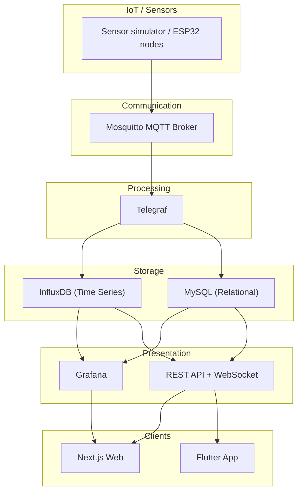

# Architecture / Arquitectura

## ES — Arquitectura (alto nivel)
**Medusse IoT** está organizado en capas desacopladas (microservicios y componentes especializados):

1. **Sensores / IoT layer**
   - Nodos (ESP32 en real / simulador en demo)
   - Publican lecturas periódicas de sensores

2. **Comunicación**
   - **MQTT broker** (Pub/Sub) con tópicos por ubicación y sensor

3. **Procesamiento**
   - **Telegraf** consume MQTT, parsea JSON y agrega temporalmente

4. **Almacenamiento**
   - **InfluxDB**: series temporales (sensores)
   - **MySQL**: datos relacionales (usuarios/config/alertas)

5. **Presentación**
   - **Grafana**: dashboards y alertas
   - **API REST + WebSocket**: acceso a datos y tiempo real

6. **Clientes**
   - **Web (Next.js)**
   - **App (Flutter)**

## EN — Architecture (high level)
**Medusse IoT** is organized in decoupled layers (microservices and specialized components):

1. **Sensors / IoT layer**
   - Nodes (real ESP32 / simulator for demo)
   - Periodic sensor readings publishing

2. **Communication**
   - **MQTT broker** (Pub/Sub) with topics per location and sensor

3. **Processing**
   - **Telegraf** consumes MQTT, parses JSON, and aggregates data

4. **Storage**
   - **InfluxDB**: time-series sensor data
   - **MySQL**: relational data (users/config/alerts)

5. **Presentation**
   - **Grafana**: dashboards and alerts
   - **REST API + WebSocket**: data access and realtime updates

6. **Clients**
   - **Web (Next.js)**
   - **App (Flutter)**

---

## Diagram / Diagrama

