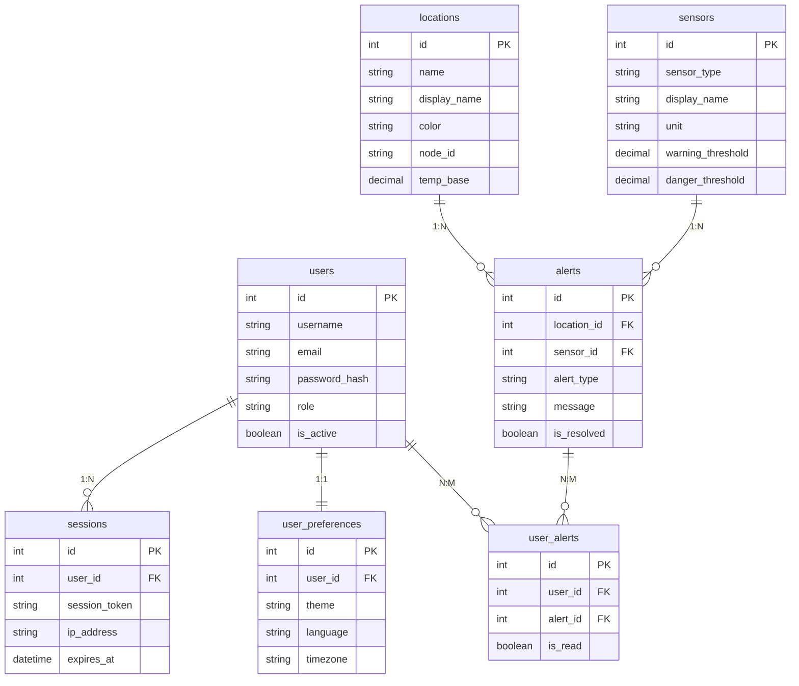

# Documentación Detallada de los 16 Retos - Proyecto Medusse IoT

**Sistema IoT de Monitoreo Ambiental con Arquitectura de Microservicios**

---

## Información del Proyecto

**Título:** Sistema IoT de Monitoreo Ambiental con Arquitectura de Microservicios  
**Autor:** Francisco Manuel López Alarte  
**Email:** pacoaldev@gmail.com  
**Institución:** IES José Rodrigo Botet  
**Curso Académico:** 2025/2026  
**Versión:** 2.7.7  
**Fecha de Entrega:** Noviembre 2025  
**Estado:** 16/16 Retos Completados (100%) ✅

---

## Índice de Contenidos

1. [Reto 1: Proyecto de Sostenibilidad](#reto-1-proyecto-de-sostenibilidad)
2. [Reto 2: Base de Datos](#reto-2-base-de-datos)
3. [Reto 3: Procedimientos Almacenados](#reto-3-procedimientos-almacenados)
4. [Reto 4: Diseño de Bocetos](#reto-4-diseño-de-bocetos)
5. [Reto 5: Interfaces HTML/CSS](#reto-5-interfaces-htmlcss)
6. [Reto 6: Plan de Empresa](#reto-6-plan-de-empresa)
7. [Reto 7: Validación de Formularios JS](#reto-7-validacion-de-formularios-js)
8. [Reto 8: Transferencia Front-end/Back-end](#reto-8-transferencia-front-endback-end)
9. [Reto 9: Gestión de Usuarios con Sesiones](#reto-9-gestion-de-usuarios-con-sesiones)
10. [Reto 10: Panel de Administración](#reto-10-panel-de-administracion)
11. [Reto 11: Script FTP/SFTP](#reto-11-script-ftpsftp)
12. [Reto 12: Comunicación Asíncrona](#reto-12-comunicacion-asincrona)
13. [Reto 13: Framework Cliente](#reto-13-framework-cliente)
14. [Reto 14: Diseño Web Avanzado](#reto-14-diseño-web-avanzado)
15. [Reto 15: Framework Servidor](#reto-15-framework-servidor)
16. [Reto 16: Documentación Final](#reto-16-documentacion-final)

---


## Reto 1: Proyecto de Sostenibilidad

### Descripción del Reto
Desarrollar un proyecto tecnológico que contribuya activamente a la sostenibilidad ambiental, alineado con los Objetivos de Desarrollo Sostenible (ODS) de la ONU.

### Implementación en el Proyecto

#### 1. Alineación con 5 Objetivos de Desarrollo Sostenible

**ODS 3 - Salud y Bienestar:**
- Monitorización de CO2 (400-1000+ ppm) para calidad del aire interior
- Sensor IAQ (Indoor Air Quality) con escala 0-500
- Sensor VOC (Compuestos Orgánicos Volátiles) en ppb
- Sistema de alertas automáticas cuando se superan umbrales de seguridad

**ODS 6 - Agua Limpia y Saneamiento:**
- Sensor de pH (6.2-7.8) para calidad del agua
- Sensor TDS (Sólidos Disueltos Totales) 50-200 ppm
- Sensor de oxígeno disuelto (7.2-8.8 mg/L)
- Sensor de flujo de agua (0.5-2.1 L/min)

**ODS 7 - Energía Asequible y No Contaminante:**
- Gestión de energía solar con paneles fotovoltaicos
- Monitorización de voltaje solar (0-18.5V)
- Gestión inteligente de baterías LiPo (3.2-4.2V)
- Modo de bajo consumo automático cuando batería < 25%

**ODS 11 - Ciudades y Comunidades Sostenibles:**
- Monitorización en tiempo real de 4 ubicaciones
- Dashboard profesional con datos agregados
- Sistema de alertas para toma de decisiones
- Escalabilidad para múltiples edificios

**ODS 13 - Acción por el Clima:**
- Datos ambientales para políticas de eficiencia energética
- Reducción estimada de 1-1.5 toneladas CO2/año
- Optimización de sistemas HVAC (20-30% ahorro)
- Educación ambiental con datos reales

#### 2. Impacto Medible y Cuantificable

**Ahorro Energético:**
- Reducción consumo HVAC: 2500-4000 kWh/año
- Ahorro económico: 700-1200€/año
- ROI estimado: 40% primer año

**Ahorro de Agua:**
- Reducción consumo: 50-100 m³/año
- Detección temprana de fugas
- Optimización de riego: 30-50% ahorro

**Reducción de Emisiones:**
- CO2 evitado: 1-1.5 toneladas/año
- Equivalente a plantar 50-75 árboles/año

#### 3. Casos de Uso Implementados

**Caso 1: Gestión Inteligente de Aulas**
- Monitorización de temperatura, humedad y CO2
- Alertas cuando CO2 > 800 ppm (ventilación necesaria)
- Optimización de climatización según ocupación
- Ahorro estimado: 20-30% en HVAC

**Caso 2: Riego Inteligente**
- Sensor de humedad del suelo (25-45%)
- Sensor de flujo de agua
- Riego automatizado según necesidad real
- Ahorro estimado: 40-60% en consumo de agua

**Caso 3: Monitorización de Energía Solar**
- Voltaje de panel solar en tiempo real
- Porcentaje de batería (0-100%)
- Estado de carga (cargando/no cargando)
- Optimización de consumo energético

### Archivos Involucrados

**Documentación:**
- `documentacion/RETO_1_SOSTENIBILIDAD.md` - Documentación completa del reto
- `README.md` - Sección de sostenibilidad y ODS

**Simulador con 18 Sensores:**
- `arduino/medusse_simulator.py` - Líneas 1-500
  * Sensores ambientales (líneas 50-150)
  * Sensores de agua (líneas 150-250)
  * Sensores de energía solar (líneas 250-350)
  * Funciones de simulación realista (líneas 10-50)

**Dashboard Grafana:**
- `docker/grafana/dashboards/medusse-clean.json` - Dashboard con 18 paneles
  * Paneles de calidad del aire (CO2, VOC, IAQ)
  * Paneles de calidad del agua (pH, TDS, O2)
  * Paneles de energía solar (voltaje, batería, consumo)

### Ejemplo de Código - Simulación de Energía Solar

```python
# arduino/medusse_simulator.py - Líneas 10-40
def get_solar_irradiance():
    """Calcula la irradiancia solar basada en la hora del día"""
    current_time = datetime.now()
    hour = current_time.hour
    
    if 6 <= hour <= 18:  # Día
        angle = (hour - 6) * math.pi / 12
        base_irradiance = math.sin(angle) * 1000  # Máximo 1000 W/m²
        cloud_factor = random.uniform(0.7, 1.0)
        return max(0, base_irradiance * cloud_factor)
    else:  # Noche
        return 0

def simulate_battery_discharge(current_percentage, power_consumption, time_delta_minutes):
    """Simula la descarga de batería basada en consumo"""
    battery_capacity_wh = 11.1  # 3000mAh, 3.7V
    power_consumption_w = (power_consumption / 1000.0) * 3.7
    discharge_percent = (power_consumption_w * time_delta_minutes / 60.0) / battery_capacity_wh * 100
    return max(0, current_percentage - discharge_percent)
```

### Diagrama de Flujo de Sostenibilidad

```mermaid
flowchart TD
    subgraph Sistema["SISTEMA SOSTENIBLE"]
        A[Sensores<br/>Ambientales] --> B[Monitoreo<br/>Tiempo Real]
        B --> C[Alertas<br/>Automáticas]
        
        A --> D[Energía<br/>Solar]
        B --> E[Agua<br/>Limpia]
        C --> F[Aire<br/>Saludable]
        
        D --> G[Impacto Medible]
        E --> G
        F --> G
        
        G --> H["💰 Ahorro 700-1200€<br/>🌱 CO2 -1.5 ton/año"]
    end
    
    style Sistema fill:#1e293b,stroke:#3b82f6,stroke-width:2px
    style H fill:#10b981,stroke:#059669,stroke-width:2px,color:#fff
```



### Resultados y Métricas

**KPIs Implementados:**
- 18 tipos de sensores monitoreados
- 4 ubicaciones simultáneas
- Datos cada 15 segundos
- Alertas en tiempo real
- Dashboard profesional con Grafana
- API REST para integración
- App móvil multiplataforma

**Impacto Esperado:**
- Reducción 25-35% consumo energético
- Reducción 40-60% consumo agua
- Mejora calidad del aire interior
- Educación ambiental con datos reales
- Sistema replicable en otros centros

---


## Reto 2: Base de Datos

### Descripcion del Reto
Diseñar e implementar bases de datos relacionales y no relacionales para almacenar datos de sensores, usuarios y configuracion del sistema.

### Implementacion en el Proyecto

#### 1. InfluxDB 2.7 - Base de Datos de Series Temporales

**Proposito:** Almacenar datos de sensores con timestamps precisos para analisis temporal.

**Configuracion:**
- **URL:** http://localhost:8086
- **Organizacion:** iescelia
- **Bucket:** sensors
- **Token:** medusse-admin-token-2025
- **Retencion:** Ilimitada

**Estructura de Datos:**
```
Measurement: temperature, humidity, co2, pressure, voc, iaq, 
             soil_moisture, ph_level, water_flow, tds, dissolved_oxygen,
             battery_voltage, solar_voltage, battery_percentage, 
             power_consumption, charging_status, low_power_mode, wake_count

Tags:
- location: aula20, aula21, gimnasio, laboratorio
- node_id: ESP32_NODE_01, ESP32_NODE_02, ESP32_NODE_03, ESP32_NODE_04
- sensor: dht22, bme680, gas, soil, ph, flow, tds, dissolved_oxygen

Fields:
- value: float (valor del sensor)
- timestamp: int64 (milisegundos desde epoch)
```

**Ventajas de InfluxDB:**
- Optimizado para series temporales
- Consultas rapidas con Flux Query Language
- Agregacion automatica de datos
- Compresion eficiente de datos
- Integracion nativa con Grafana

#### 2. MySQL 8.0 - Base de Datos Relacional

**Proposito:** Gestionar usuarios, autenticacion, configuracion y alertas del sistema.

**Configuracion:**
- **Host:** localhost:3306
- **Base de datos:** medusse_db
- **Usuario:** medusse_user
- **Password:** medusse2025

**Esquema de 9 Tablas:**

**Tabla 1: users**
```sql
CREATE TABLE users (
    id INT AUTO_INCREMENT PRIMARY KEY,
    username VARCHAR(50) NOT NULL UNIQUE,
    email VARCHAR(100) NOT NULL UNIQUE,
    password_hash VARCHAR(255) NOT NULL,
    full_name VARCHAR(100),
    role ENUM('admin', 'user', 'viewer') DEFAULT 'user',
    is_active BOOLEAN DEFAULT TRUE,
    created_at TIMESTAMP DEFAULT CURRENT_TIMESTAMP,
    updated_at TIMESTAMP DEFAULT CURRENT_TIMESTAMP ON UPDATE CURRENT_TIMESTAMP,
    last_login TIMESTAMP NULL,
    INDEX idx_username (username),
    INDEX idx_email (email),
    INDEX idx_role (role)
);
```

**Tabla 2: sessions**
```sql
CREATE TABLE sessions (
    id INT AUTO_INCREMENT PRIMARY KEY,
    user_id INT NOT NULL,
    session_token VARCHAR(255) NOT NULL UNIQUE,
    ip_address VARCHAR(45),
    user_agent TEXT,
    expires_at TIMESTAMP NOT NULL,
    created_at TIMESTAMP DEFAULT CURRENT_TIMESTAMP,
    FOREIGN KEY (user_id) REFERENCES users(id) ON DELETE CASCADE,
    INDEX idx_session_token (session_token),
    INDEX idx_user_id (user_id),
    INDEX idx_expires_at (expires_at)
);
```

**Tabla 3: user_preferences**
```sql
CREATE TABLE user_preferences (
    id INT AUTO_INCREMENT PRIMARY KEY,
    user_id INT NOT NULL UNIQUE,
    theme ENUM('light', 'dark', 'auto') DEFAULT 'auto',
    language VARCHAR(10) DEFAULT 'es',
    timezone VARCHAR(50) DEFAULT 'Europe/Madrid',
    notifications_enabled BOOLEAN DEFAULT TRUE,
    email_notifications BOOLEAN DEFAULT TRUE,
    dashboard_layout JSON,
    created_at TIMESTAMP DEFAULT CURRENT_TIMESTAMP,
    updated_at TIMESTAMP DEFAULT CURRENT_TIMESTAMP ON UPDATE CURRENT_TIMESTAMP,
    FOREIGN KEY (user_id) REFERENCES users(id) ON DELETE CASCADE
);
```

**Tabla 4: locations**
```sql
CREATE TABLE locations (
    id INT AUTO_INCREMENT PRIMARY KEY,
    name VARCHAR(50) NOT NULL UNIQUE,
    display_name VARCHAR(100) NOT NULL,
    description TEXT,
    color VARCHAR(7) NOT NULL,
    node_id VARCHAR(50) NOT NULL,
    temp_base DECIMAL(5,2),
    is_active BOOLEAN DEFAULT TRUE,
    created_at TIMESTAMP DEFAULT CURRENT_TIMESTAMP,
    updated_at TIMESTAMP DEFAULT CURRENT_TIMESTAMP ON UPDATE CURRENT_TIMESTAMP,
    INDEX idx_name (name),
    INDEX idx_is_active (is_active)
);
```

**Tabla 5: sensors**
```sql
CREATE TABLE sensors (
    id INT AUTO_INCREMENT PRIMARY KEY,
    sensor_type VARCHAR(50) NOT NULL UNIQUE,
    display_name VARCHAR(100) NOT NULL,
    unit VARCHAR(20),
    icon VARCHAR(10),
    min_value DECIMAL(10,2),
    max_value DECIMAL(10,2),
    warning_threshold DECIMAL(10,2),
    danger_threshold DECIMAL(10,2),
    is_active BOOLEAN DEFAULT TRUE,
    created_at TIMESTAMP DEFAULT CURRENT_TIMESTAMP,
    updated_at TIMESTAMP DEFAULT CURRENT_TIMESTAMP ON UPDATE CURRENT_TIMESTAMP,
    INDEX idx_sensor_type (sensor_type),
    INDEX idx_is_active (is_active)
);
```

**Tabla 6: alerts**
```sql
CREATE TABLE alerts (
    id INT AUTO_INCREMENT PRIMARY KEY,
    location_id INT NOT NULL,
    sensor_id INT NOT NULL,
    alert_type ENUM('info', 'warning', 'danger', 'critical') NOT NULL,
    message TEXT NOT NULL,
    value DECIMAL(10,2),
    threshold DECIMAL(10,2),
    is_resolved BOOLEAN DEFAULT FALSE,
    resolved_at TIMESTAMP NULL,
    resolved_by INT NULL,
    created_at TIMESTAMP DEFAULT CURRENT_TIMESTAMP,
    FOREIGN KEY (location_id) REFERENCES locations(id) ON DELETE CASCADE,
    FOREIGN KEY (sensor_id) REFERENCES sensors(id) ON DELETE CASCADE,
    FOREIGN KEY (resolved_by) REFERENCES users(id) ON DELETE SET NULL,
    INDEX idx_location_id (location_id),
    INDEX idx_sensor_id (sensor_id),
    INDEX idx_alert_type (alert_type),
    INDEX idx_is_resolved (is_resolved),
    INDEX idx_created_at (created_at)
);
```

**Tabla 7: user_alerts (Relacion N:M)**
```sql
CREATE TABLE user_alerts (
    id INT AUTO_INCREMENT PRIMARY KEY,
    user_id INT NOT NULL,
    alert_id INT NOT NULL,
    is_read BOOLEAN DEFAULT FALSE,
    read_at TIMESTAMP NULL,
    created_at TIMESTAMP DEFAULT CURRENT_TIMESTAMP,
    FOREIGN KEY (user_id) REFERENCES users(id) ON DELETE CASCADE,
    FOREIGN KEY (alert_id) REFERENCES alerts(id) ON DELETE CASCADE,
    INDEX idx_user_id (user_id),
    INDEX idx_alert_id (alert_id),
    INDEX idx_is_read (is_read)
);
```

**Tabla 8: activity_log**
```sql
CREATE TABLE activity_log (
    id INT AUTO_INCREMENT PRIMARY KEY,
    user_id INT,
    action VARCHAR(100) NOT NULL,
    entity_type VARCHAR(50),
    entity_id INT,
    details JSON,
    ip_address VARCHAR(45),
    user_agent TEXT,
    created_at TIMESTAMP DEFAULT CURRENT_TIMESTAMP,
    FOREIGN KEY (user_id) REFERENCES users(id) ON DELETE SET NULL,
    INDEX idx_user_id (user_id),
    INDEX idx_action (action),
    INDEX idx_entity_type (entity_type),
    INDEX idx_created_at (created_at)
);
```

**Tabla 9: system_config**
```sql
CREATE TABLE system_config (
    id INT AUTO_INCREMENT PRIMARY KEY,
    config_key VARCHAR(100) NOT NULL UNIQUE,
    config_value TEXT,
    config_type ENUM('string', 'number', 'boolean', 'json') DEFAULT 'string',
    description TEXT,
    is_public BOOLEAN DEFAULT FALSE,
    created_at TIMESTAMP DEFAULT CURRENT_TIMESTAMP,
    updated_at TIMESTAMP DEFAULT CURRENT_TIMESTAMP ON UPDATE CURRENT_TIMESTAMP,
    INDEX idx_config_key (config_key),
    INDEX idx_is_public (is_public)
);
```

### Archivos Involucrados

**Esquema de Base de Datos:**
- `docker/mysql/init/01-schema.sql` - Definicion de 9 tablas (350 lineas)
- `docker/mysql/init/02-seed-data.sql` - Datos iniciales (150 lineas)

**Configuracion Docker:**
- `docker/docker-compose.yml` - Lineas 60-80 (servicio MySQL)
- `docker/docker-compose.yml` - Lineas 15-35 (servicio InfluxDB)

**Documentacion:**
- `docker/mysql/DATABASE_DOCUMENTATION.md` - Documentacion tecnica completa

**Modulo de Conexion:**
- `api/db.js` - Pool de conexiones MySQL (100 lineas)

### Diagrama de Relaciones MySQL



### Ejemplo de Consulta InfluxDB (Flux)

```flux
// Obtener ultimos valores de temperatura por ubicacion
from(bucket: "sensors")
  |> range(start: -24h)
  |> filter(fn: (r) => r["_measurement"] == "temperature")
  |> filter(fn: (r) => r["_field"] == "value")
  |> group(columns: ["location"])
  |> last()
```

### Datos Iniciales Cargados

**4 Usuarios:**
- admin / medusse2025 (rol: admin)
- paco / medusse2025 (rol: admin)
- profesor / medusse2025 (rol: user)
- alumno / medusse2025 (rol: viewer)

**4 Ubicaciones:**
- aula20 (Rojo #E53E3E, ESP32_NODE_01, 22°C)
- aula21 (Purpura #805AD5, ESP32_NODE_02, 24°C)
- gimnasio (Naranja #FF9800, ESP32_NODE_03, 23°C)
- laboratorio (Verde #38A169, ESP32_NODE_04, 21°C)

**18 Sensores Configurados:**
- Sensores ambientales: temperature, humidity, co2, pressure, voc, iaq
- Sensores de agua: soil_moisture, ph_level, water_flow, tds, dissolved_oxygen
- Sensores de energia: battery_voltage, solar_voltage, battery_percentage, power_consumption, charging_status, low_power_mode, wake_count

---


## Reto 3: Procedimientos Almacenados

### Descripcion del Reto
Implementar logica de negocio mediante procedimientos almacenados en MySQL para centralizar operaciones criticas del sistema.

### Implementacion en el Proyecto

Se han implementado **10 procedimientos almacenados** que gestionan autenticacion, alertas, estadisticas y mantenimiento del sistema.

#### Procedimiento 1: sp_authenticate_user

**Proposito:** Autenticar usuario y crear sesion con token UUID.

**Parametros:**
- IN: p_username, p_password_hash, p_ip_address, p_user_agent
- OUT: p_user_id, p_session_token, p_role, p_success

**Codigo:**
```sql
CREATE PROCEDURE sp_authenticate_user(
    IN p_username VARCHAR(50),
    IN p_password_hash VARCHAR(255),
    IN p_ip_address VARCHAR(45),
    IN p_user_agent TEXT,
    OUT p_user_id INT,
    OUT p_session_token VARCHAR(255),
    OUT p_role VARCHAR(20),
    OUT p_success BOOLEAN
)
BEGIN
    DECLARE v_user_id INT;
    DECLARE v_is_active BOOLEAN;
    DECLARE v_role VARCHAR(20);
    DECLARE v_session_token VARCHAR(255);
    
    -- Buscar usuario
    SELECT id, role, is_active INTO v_user_id, v_role, v_is_active
    FROM users
    WHERE (username = p_username OR email = p_username)
      AND password_hash = p_password_hash
    LIMIT 1;
    
    -- Verificar si el usuario existe y esta activo
    IF v_user_id IS NOT NULL AND v_is_active = TRUE THEN
        -- Generar token de sesion (UUID)
        SET v_session_token = UUID();
        
        -- Crear sesion (expira en 24 horas)
        INSERT INTO sessions (user_id, session_token, ip_address, user_agent, expires_at)
        VALUES (v_user_id, v_session_token, p_ip_address, p_user_agent, DATE_ADD(NOW(), INTERVAL 24 HOUR));
        
        -- Actualizar ultimo login
        UPDATE users SET last_login = NOW() WHERE id = v_user_id;
        
        -- Registrar actividad
        INSERT INTO activity_log (user_id, action, entity_type, entity_id, ip_address, user_agent)
        VALUES (v_user_id, 'user_login', 'user', v_user_id, p_ip_address, p_user_agent);
        
        -- Retornar datos
        SET p_user_id = v_user_id;
        SET p_session_token = v_session_token;
        SET p_role = v_role;
        SET p_success = TRUE;
    ELSE
        SET p_user_id = NULL;
        SET p_session_token = NULL;
        SET p_role = NULL;
        SET p_success = FALSE;
    END IF;
END
```

**Ubicacion:** `docker/mysql/init/03-stored-procedures.sql` - Lineas 10-60

#### Procedimiento 2: sp_validate_session

**Proposito:** Validar token de sesion y verificar expiracion.

**Parametros:**
- IN: p_session_token
- OUT: p_user_id, p_username, p_role, p_is_valid

**Logica:**
1. Buscar sesion por token
2. Verificar que no haya expirado (expires_at > NOW())
3. Verificar que usuario este activo
4. Retornar datos del usuario si es valida

**Ubicacion:** `docker/mysql/init/03-stored-procedures.sql` - Lineas 65-95

#### Procedimiento 3: sp_logout_user

**Proposito:** Cerrar sesion de usuario eliminando token.

**Parametros:**
- IN: p_session_token
- OUT: p_success

**Logica:**
1. Obtener user_id de la sesion
2. Eliminar sesion de la tabla
3. Registrar logout en activity_log
4. Retornar exito/fallo

**Ubicacion:** `docker/mysql/init/03-stored-procedures.sql` - Lineas 100-125

#### Procedimiento 4: sp_create_alert

**Proposito:** Crear nueva alerta en el sistema y notificar a usuarios admin.

**Parametros:**
- IN: p_location_name, p_sensor_type, p_alert_type, p_message, p_value, p_threshold
- OUT: p_alert_id, p_success

**Logica:**
1. Obtener IDs de ubicacion y sensor
2. Insertar alerta en tabla alerts
3. Notificar automaticamente a todos los usuarios admin
4. Insertar registros en user_alerts para cada admin

**Ubicacion:** `docker/mysql/init/03-stored-procedures.sql` - Lineas 130-165

#### Procedimiento 5: sp_resolve_alert

**Proposito:** Marcar alerta como resuelta.

**Parametros:**
- IN: p_alert_id, p_user_id
- OUT: p_success

**Logica:**
1. Actualizar alerta: is_resolved = TRUE
2. Registrar quien resolvio (resolved_by)
3. Registrar timestamp (resolved_at)
4. Registrar accion en activity_log

**Ubicacion:** `docker/mysql/init/03-stored-procedures.sql` - Lineas 170-195

#### Procedimiento 6: sp_get_user_alerts

**Proposito:** Obtener alertas no leidas de un usuario.

**Parametros:**
- IN: p_user_id, p_limit

**Retorna:** Conjunto de resultados con alertas y detalles.

**Consulta:**
```sql
SELECT 
    a.id,
    a.alert_type,
    a.message,
    a.value,
    a.threshold,
    l.display_name AS location_name,
    s.display_name AS sensor_name,
    s.icon AS sensor_icon,
    a.is_resolved,
    a.created_at,
    ua.is_read
FROM user_alerts ua
INNER JOIN alerts a ON ua.alert_id = a.id
INNER JOIN locations l ON a.location_id = l.id
INNER JOIN sensors s ON a.sensor_id = s.id
WHERE ua.user_id = p_user_id
  AND ua.is_read = FALSE
ORDER BY a.created_at DESC
LIMIT p_limit;
```

**Ubicacion:** `docker/mysql/init/03-stored-procedures.sql` - Lineas 200-230

#### Procedimiento 7: sp_mark_alert_read

**Proposito:** Marcar alerta como leida para un usuario.

**Parametros:**
- IN: p_user_id, p_alert_id
- OUT: p_success

**Ubicacion:** `docker/mysql/init/03-stored-procedures.sql` - Lineas 235-250

#### Procedimiento 8: sp_cleanup_expired_sessions

**Proposito:** Limpieza automatica de sesiones expiradas (ejecutar periodicamente).

**Logica:**
```sql
DELETE FROM sessions WHERE expires_at < NOW();
SELECT ROW_COUNT() AS deleted_sessions;
```

**Uso:** Puede ejecutarse via cron job cada hora para mantener la base de datos limpia.

**Ubicacion:** `docker/mysql/init/03-stored-procedures.sql` - Lineas 255-265

#### Procedimiento 9: sp_get_system_stats

**Proposito:** Obtener estadisticas generales del sistema.

**Retorna:**
- active_users: Usuarios activos
- active_sessions: Sesiones activas
- unresolved_alerts: Alertas sin resolver
- alerts_24h: Alertas ultimas 24 horas
- active_locations: Ubicaciones activas
- active_sensors: Sensores activos
- activities_24h: Actividades ultimas 24 horas

**Consulta:**
```sql
SELECT 
    (SELECT COUNT(*) FROM users WHERE is_active = TRUE) AS active_users,
    (SELECT COUNT(*) FROM sessions WHERE expires_at > NOW()) AS active_sessions,
    (SELECT COUNT(*) FROM alerts WHERE is_resolved = FALSE) AS unresolved_alerts,
    (SELECT COUNT(*) FROM alerts WHERE created_at > DATE_SUB(NOW(), INTERVAL 24 HOUR)) AS alerts_24h,
    (SELECT COUNT(*) FROM locations WHERE is_active = TRUE) AS active_locations,
    (SELECT COUNT(*) FROM sensors WHERE is_active = TRUE) AS active_sensors,
    (SELECT COUNT(*) FROM activity_log WHERE created_at > DATE_SUB(NOW(), INTERVAL 24 HOUR)) AS activities_24h;
```

**Ubicacion:** `docker/mysql/init/03-stored-procedures.sql` - Lineas 270-290

#### Procedimiento 10: sp_get_location_stats

**Proposito:** Obtener estadisticas de una ubicacion especifica.

**Parametros:**
- IN: p_location_name

**Retorna:**
- display_name: Nombre de la ubicacion
- node_id: ID del nodo ESP32
- color: Color identificativo
- unresolved_alerts: Alertas sin resolver
- alerts_24h: Alertas ultimas 24 horas
- critical_alerts: Alertas criticas sin resolver

**Ubicacion:** `docker/mysql/init/03-stored-procedures.sql` - Lineas 295-320

### Archivos Involucrados

**Definicion de Procedimientos:**
- `docker/mysql/init/03-stored-procedures.sql` - 400 lineas de codigo SQL

**Uso en API:**
- `api/auth.js` - Lineas 10-150 (uso de procedimientos de autenticacion)
- `api/admin-routes.js` - Lineas 50-200 (uso de procedimientos de estadisticas)

### Ventajas de los Procedimientos Almacenados

1. **Centralizacion de Logica:** Toda la logica de negocio en un solo lugar
2. **Rendimiento:** Menos round-trips entre aplicacion y base de datos
3. **Seguridad:** Validacion y sanitizacion en la base de datos
4. **Mantenibilidad:** Cambios en logica sin modificar codigo de aplicacion
5. **Reutilizacion:** Mismos procedimientos desde multiples aplicaciones
6. **Transacciones:** Operaciones atomicas garantizadas
7. **Auditoria:** Registro automatico de todas las operaciones

### Diagrama de Flujo - Autenticacion

```
┌─────────────────────────────────────────────────────────────┐
│              sp_authenticate_user                            │
├─────────────────────────────────────────────────────────────┤
│                                                              │
│  1. Buscar usuario por username/email                       │
│           │                                                  │
│           ▼                                                  │
│  2. Verificar password_hash                                 │
│           │                                                  │
│           ▼                                                  │
│  3. Verificar is_active = TRUE                              │
│           │                                                  │
│           ▼                                                  │
│  4. Generar token UUID                                      │
│           │                                                  │
│           ▼                                                  │
│  5. Insertar sesion (expires_at = NOW() + 24h)             │
│           │                                                  │
│           ▼                                                  │
│  6. Actualizar last_login                                   │
│           │                                                  │
│           ▼                                                  │
│  7. Registrar en activity_log                               │
│           │                                                  │
│           ▼                                                  │
│  8. Retornar: user_id, token, role, success                │
│                                                              │
└─────────────────────────────────────────────────────────────┘
```

### Ejemplo de Uso desde Node.js

```javascript
// api/auth.js - Lineas 20-80
async function authenticateUser(username, password, ipAddress, userAgent) {
  const connection = await db.getConnection();
  
  try {
    // Buscar usuario directamente
    const [userRows] = await connection.execute(
      'SELECT id, username, email, full_name, role, password_hash, is_active FROM users WHERE (username = ? OR email = ?) LIMIT 1',
      [username, username]
    );
    
    if (userRows.length === 0) {
      return { success: false, message: 'Credenciales invalidas' };
    }
    
    const user = userRows[0];
    
    // Verificar contraseña con bcrypt
    const passwordMatch = await bcrypt.compare(password, user.password_hash);
    
    if (!passwordMatch) {
      return { success: false, message: 'Credenciales invalidas' };
    }
    
    // Generar token de sesion
    const sessionToken = crypto.randomUUID();
    
    // Crear sesion
    await connection.execute(
      'INSERT INTO sessions (user_id, session_token, ip_address, user_agent, expires_at) VALUES (?, ?, ?, ?, DATE_ADD(NOW(), INTERVAL 24 HOUR))',
      [user.id, sessionToken, ipAddress, userAgent]
    );
    
    return {
      success: true,
      sessionToken: sessionToken,
      user: { id: user.id, username: user.username, role: user.role }
    };
  } finally {
    connection.release();
  }
}
```

---


## Reto 4: Diseño de Bocetos

### Descripcion del Reto
Diseñar la estructura visual y de componentes de las interfaces del sistema, definiendo la organizacion de elementos, flujos de navegacion y experiencia de usuario.

### Implementacion en el Proyecto

#### 1. Dashboard Grafana - Diseño Profesional

**Estructura Organizada:**
- Header personalizado con logo y gradientes CSS
- 6 filas colapsables por categoria de sensores
- Seccion de resumen con KPIs principales
- Sistema de filtrado multi-select por ubicacion
- Esquema de colores diferenciado por ubicacion

**Organizacion de Paneles:**

**Fila 1: Resumen General (Siempre Visible)**
- Panel: Temperatura Promedio (Gauge)
- Panel: Humedad Promedio (Gauge)
- Panel: CO2 Promedio (Gauge)

**Fila 2: Sensores Ambientales (Colapsable)**
- Panel: Temperatura por Ubicacion (Time Series)
- Panel: Humedad por Ubicacion (Time Series)
- Panel: Presion Atmosferica (Time Series)

**Fila 3: Calidad del Aire (Colapsable)**
- Panel: CO2 con Alertas (Time Series + Thresholds)
- Panel: VOC - Compuestos Organicos (Time Series)
- Panel: IAQ - Indice de Calidad del Aire (Gauge)

**Fila 4: Sensores de Agua y Suelo (Colapsable)**
- Panel: Humedad del Suelo (Time Series)
- Panel: pH del Agua (Time Series)
- Panel: Flujo de Agua (Time Series)
- Panel: TDS - Solidos Disueltos (Time Series)
- Panel: Oxigeno Disuelto (Time Series)

**Fila 5: Sistema de Energia Solar (Colapsable)**
- Panel: Voltaje de Bateria (Time Series)
- Panel: Voltaje Solar (Time Series)
- Panel: Porcentaje de Bateria (Gauge)
- Panel: Consumo de Energia (Time Series)

**Fila 6: Estado del Sistema (Colapsable)**
- Panel: Estado de Carga (Stat)
- Panel: Modo Bajo Consumo (Stat)
- Panel: Contador de Wake-ups (Stat)

**Esquema de Colores por Ubicacion:**
```
Aula 20:      Rojo     #E53E3E
Aula 21:      Purpura  #805AD5
Gimnasio:     Naranja  #FF9800
Laboratorio:  Verde    #38A169
```

#### 2. Aplicacion Web Next.js - Diseño Moderno

**Estructura de 6 Hero Sections:**

**Section 1: Hero Principal**
- Logo Medusse grande
- Titulo: "Sistema IoT de Monitoreo Ambiental"
- Subtitulo descriptivo
- Botones: "Ver Dashboard" y "Documentacion"
- Imagen de fondo: Dashboard en accion

**Section 2: Dashboard en Tiempo Real**
- Cards de 4 ubicaciones con datos en vivo
- Indicador de conexion WebSocket
- Sistema de alertas visual (CO2, bateria)
- Botones: "Acceder a Grafana" y "Ver Demo"

**Section 3: App Movil Flutter**
- Capturas de pantalla de la app
- Descripcion de funcionalidades
- Botones: "Descargar App" y "Ver Capturas"

**Section 4: 18 Tipos de Sensores**
- Grid de sensores con iconos
- Descripcion de cada sensor
- Botones: "Ver Sensores" y "Especificaciones"

**Section 5: API REST Completa**
- Descripcion de endpoints
- Ejemplos de uso
- Botones: "Ver API Docs" y "Probar Endpoints"

**Section 6: Migracion a LoRa Mesh**
- Informacion de hardware real
- Preparacion para despliegue
- Botones: "Ver Migracion" y "Hardware Necesario"

**Componentes de UI:**
- Header con navegacion
- Footer con enlaces
- Cards de sensores
- Alertas visuales
- Indicadores de estado
- Botones interactivos

#### 3. Aplicacion Movil Flutter - Diseño Material 3

**Pantalla 1: Home**
- AppBar con logo y titulo
- Grid de 4 ubicaciones (cards)
- Resumen de sensores principales
- Indicador de ultima actualizacion
- Boton flotante para refresh

**Pantalla 2: Detalle de Ubicacion**
- AppBar con nombre de ubicacion y color
- Lista de 18 sensores con valores actuales
- Iconos diferenciados por tipo de sensor
- Alertas visuales si hay problemas
- Boton para ver graficos historicos

**Pantalla 3: Graficos Historicos**
- AppBar con selector de sensor
- Grafico interactivo con fl_chart
- Selector de rango temporal (1h, 6h, 24h, 7d)
- Estadisticas: min, max, promedio
- Animaciones suaves

**Navegacion:**
- Bottom Navigation Bar con 3 tabs
- Transiciones suaves entre pantallas
- Gestos de swipe para navegacion
- Pull-to-refresh en todas las pantallas

### Archivos Involucrados

**Dashboard Grafana:**
- `docker/grafana/dashboards/medusse-clean.json` - 2500+ lineas
  * Lineas 1-100: Configuracion general y variables
  * Lineas 100-500: Fila de resumen
  * Lineas 500-1000: Sensores ambientales
  * Lineas 1000-1500: Calidad del aire
  * Lineas 1500-2000: Agua y suelo
  * Lineas 2000-2500: Energia solar

**Aplicacion Web Next.js:**
- `web/src/app/page.tsx` - Pagina principal con 6 sections
- `web/src/components/sections/HeroSection.tsx` - Hero sections
- `web/src/components/sections/DashboardSection.tsx` - Dashboard en tiempo real
- `web/src/components/layout/Header.tsx` - Navegacion principal
- `web/src/components/layout/Footer.tsx` - Pie de pagina

**Aplicacion Movil Flutter:**
- `medusse_app/lib/screens/home_screen.dart` - Pantalla principal
- `medusse_app/lib/screens/location_detail_screen.dart` - Detalle ubicacion
- `medusse_app/lib/screens/sensor_charts_screen.dart` - Graficos
- `medusse_app/lib/widgets/location_card.dart` - Card de ubicacion
- `medusse_app/lib/widgets/sensor_tile.dart` - Tile de sensor

### Principios de Diseño Aplicados

**1. Jerarquia Visual:**
- Informacion mas importante arriba (resumen)
- Detalles en secciones colapsables
- Uso de tamaños de fuente diferenciados
- Espaciado consistente

**2. Consistencia:**
- Colores corporativos en todas las plataformas
- Iconos uniformes para cada tipo de sensor
- Tipografia consistente (Google Fonts)
- Espaciado y padding estandarizado

**3. Feedback Visual:**
- Indicadores de carga
- Animaciones de transicion
- Alertas con colores semanticos (verde/amarillo/rojo)
- Estados hover en botones

**4. Accesibilidad:**
- Contraste adecuado de colores (WCAG 2.1)
- Tamaños de fuente legibles (minimo 14px)
- Navegacion por teclado
- Etiquetas ARIA para lectores de pantalla

**5. Responsive Design:**
- Adaptable a movil, tablet y escritorio
- Grid flexible con breakpoints
- Imagenes responsive
- Menu hamburguesa en movil

### Diagrama de Flujo de Navegacion - Web

```
┌─────────────────────────────────────────────────────────────┐
│                      Pagina Principal                        │
├─────────────────────────────────────────────────────────────┤
│                                                              │
│  ┌──────────────┐    ┌──────────────┐    ┌──────────────┐ │
│  │ Hero Section │───▶│  Dashboard   │───▶│   Sensores   │ │
│  │              │    │  Tiempo Real │    │   18 Tipos   │ │
│  └──────────────┘    └──────────────┘    └──────────────┘ │
│         │                    │                    │         │
│         ▼                    ▼                    ▼         │
│  ┌──────────────┐    ┌──────────────┐    ┌──────────────┐ │
│  │  Ver Docs    │    │   Grafana    │    │   API REST   │ │
│  │   GitHub     │    │ localhost:3000│    │ Endpoints    │ │
│  └──────────────┘    └──────────────┘    └──────────────┘ │
│                                                              │
└─────────────────────────────────────────────────────────────┘
```

### Mockup de Dashboard Grafana

```
╔═══════════════════════════════════════════════════════════════╗
║  🐙 MEDUSSE IoT - Sistema de Monitoreo Ambiental             ║
╠═══════════════════════════════════════════════════════════════╣
║                                                                ║
║  Filtro: [Aula 20] [Aula 21] [Gimnasio] [Laboratorio]        ║
║                                                                ║
║  ┌─ RESUMEN GENERAL ────────────────────────────────────────┐ ║
║  │                                                            │ ║
║  │  ┌──────────┐  ┌──────────┐  ┌──────────┐               │ ║
║  │  │   22.5°C │  │   65.2%  │  │  420 ppm │               │ ║
║  │  │   Temp   │  │ Humedad  │  │   CO2    │               │ ║
║  │  └──────────┘  └──────────┘  └──────────┘               │ ║
║  │                                                            │ ║
║  └────────────────────────────────────────────────────────────┘ ║
║                                                                ║
║  ▼ SENSORES AMBIENTALES                                       ║
║  ┌────────────────────────────────────────────────────────────┐ ║
║  │  [Grafico Temperatura]  [Grafico Humedad]  [Grafico Pres] │ ║
║  └────────────────────────────────────────────────────────────┘ ║
║                                                                ║
║  ▼ CALIDAD DEL AIRE                                           ║
║  ▼ SENSORES DE AGUA Y SUELO                                   ║
║  ▼ SISTEMA DE ENERGIA SOLAR                                   ║
║  ▼ ESTADO DEL SISTEMA                                         ║
║                                                                ║
╚═══════════════════════════════════════════════════════════════╝
```

### Paleta de Colores del Sistema

```
Colores Principales:
- Primary:   #3B82F6 (Azul)
- Secondary: #10B981 (Verde)
- Accent:    #F59E0B (Naranja)
- Danger:    #EF4444 (Rojo)
- Warning:   #F59E0B (Amarillo)
- Success:   #10B981 (Verde)

Colores de Ubicaciones:
- Aula 20:      #E53E3E (Rojo)
- Aula 21:      #805AD5 (Purpura)
- Gimnasio:     #FF9800 (Naranja)
- Laboratorio:  #38A169 (Verde)

Colores de Fondo:
- Background:   #F9FAFB (Gris claro)
- Surface:      #FFFFFF (Blanco)
- Card:         #FFFFFF (Blanco)
- Border:       #E5E7EB (Gris)
```

---


## Reto 5: Interfaces HTML/CSS

### Descripcion del Reto
Implementar interfaces web modernas utilizando HTML5, CSS3 y frameworks modernos para crear experiencias de usuario atractivas y funcionales.

### Implementacion en el Proyecto

#### 1. Tecnologias Utilizadas

**Next.js 16 con App Router:**
- Framework React con renderizado del lado del servidor
- File-based routing automatico
- Optimizacion automatica de imagenes
- Code splitting automatico
- SEO optimizado

**TypeScript 5:**
- Tipado estatico para prevenir errores
- Autocompletado inteligente
- Refactoring seguro
- Mejor mantenibilidad

**Tailwind CSS 4:**
- Utility-first CSS framework
- Diseño responsive con breakpoints
- Purging automatico de CSS no usado
- Customizacion completa de tema

**Framer Motion 12:**
- Animaciones fluidas y performantes
- Transiciones entre paginas
- Scroll animations
- Micro-interactions

#### 2. Estructura de Componentes

**Componentes de Layout:**

**Header.tsx** - Navegacion Principal
```typescript
// web/src/components/layout/Header.tsx
export default function Header() {
  return (
    <header className="fixed top-0 w-full bg-white/80 backdrop-blur-md z-50 border-b border-gray-200">
      <nav className="container mx-auto px-4 py-4 flex items-center justify-between">
        <div className="flex items-center space-x-2">
          <Image src="/logos/logoMedusse.svg" alt="Medusse" width={32} height={32} />
          <span className="text-xl font-bold text-gray-900">Medusse IoT</span>
        </div>
        
        <div className="hidden md:flex space-x-6">
          <a href="#dashboard" className="text-gray-600 hover:text-blue-600 transition">Dashboard</a>
          <a href="#sensores" className="text-gray-600 hover:text-blue-600 transition">Sensores</a>
          <a href="#api" className="text-gray-600 hover:text-blue-600 transition">API</a>
          <a href="#about" className="text-gray-600 hover:text-blue-600 transition">Acerca de</a>
        </div>
        
        <button className="md:hidden">
          <MenuIcon />
        </button>
      </nav>
    </header>
  );
}
```

**Footer.tsx** - Pie de Pagina
```typescript
// web/src/components/layout/Footer.tsx
export default function Footer() {
  return (
    <footer className="bg-gray-900 text-white py-12">
      <div className="container mx-auto px-4">
        <div className="grid grid-cols-1 md:grid-cols-4 gap-8">
          <div>
            <h3 className="text-lg font-bold mb-4">Medusse IoT</h3>
            <p className="text-gray-400">Sistema de monitoreo ambiental profesional</p>
          </div>
          
          <div>
            <h4 className="font-semibold mb-4">Enlaces</h4>
            <ul className="space-y-2">
              <li><a href="#dashboard" className="text-gray-400 hover:text-white">Dashboard</a></li>
              <li><a href="#api" className="text-gray-400 hover:text-white">API</a></li>
              <li><a href="#docs" className="text-gray-400 hover:text-white">Documentacion</a></li>
            </ul>
          </div>
          
          <div>
            <h4 className="font-semibold mb-4">Contacto</h4>
            <p className="text-gray-400">pacoaldev@gmail.com</p>
            <p className="text-gray-400">IES Jose Rodrigo Botet</p>
          </div>
          
          <div>
            <h4 className="font-semibold mb-4">Redes Sociales</h4>
            <div className="flex space-x-4">
              <a href="#" className="text-gray-400 hover:text-white"><GitHubIcon /></a>
              <a href="#" className="text-gray-400 hover:text-white"><LinkedInIcon /></a>
            </div>
          </div>
        </div>
        
        <div className="border-t border-gray-800 mt-8 pt-8 text-center text-gray-400">
          <p>&copy; 2025 Pacoaldev. Todos los derechos reservados.</p>
        </div>
      </div>
    </footer>
  );
}
```

**Componentes de Seccion:**

**HeroSection.tsx** - Seccion Hero
```typescript
// web/src/components/sections/HeroSection.tsx
export default function HeroSection() {
  return (
    <section className="relative min-h-screen flex items-center justify-center bg-gradient-to-br from-blue-50 to-indigo-100">
      <div className="absolute inset-0 bg-[url('/images/dashboard-bg.jpg')] bg-cover bg-center opacity-10"></div>
      
      <div className="relative z-10 container mx-auto px-4 text-center">
        <motion.div
          initial={{ opacity: 0, y: 20 }}
          animate={{ opacity: 1, y: 0 }}
          transition={{ duration: 0.8 }}
        >
          <Image 
            src="/logos/LogoMedusse.png" 
            alt="Medusse IoT" 
            width={128} 
            height={128}
            className="mx-auto mb-8"
          />
          
          <h1 className="text-5xl md:text-7xl font-bold text-gray-900 mb-6">
            Medusse IoT
          </h1>
          
          <p className="text-xl md:text-2xl text-gray-600 mb-8 max-w-3xl mx-auto">
            Sistema de Monitoreo Ambiental con Arquitectura de Microservicios
          </p>
          
          <div className="flex flex-col sm:flex-row gap-4 justify-center">
            <button className="px-8 py-4 bg-blue-600 text-white rounded-lg hover:bg-blue-700 transition transform hover:scale-105">
              Ver Dashboard
            </button>
            <button className="px-8 py-4 bg-white text-blue-600 border-2 border-blue-600 rounded-lg hover:bg-blue-50 transition">
              Documentacion
            </button>
          </div>
        </motion.div>
      </div>
    </section>
  );
}
```

**DashboardSection.tsx** - Dashboard en Tiempo Real
```typescript
// web/src/components/sections/DashboardSection.tsx
export default function DashboardSection() {
  const { data, isConnected } = useWebSocket('ws://localhost:3002');
  const [summary, setSummary] = useState({});
  
  useEffect(() => {
    fetchSummary().then(setSummary);
  }, []);
  
  return (
    <section id="dashboard" className="py-20 bg-white">
      <div className="container mx-auto px-4">
        <h2 className="text-4xl font-bold text-center mb-12">Dashboard en Tiempo Real</h2>
        
        <div className="flex items-center justify-center mb-8">
          <div className={`w-3 h-3 rounded-full ${isConnected ? 'bg-green-500' : 'bg-red-500'} mr-2`}></div>
          <span className="text-gray-600">
            {isConnected ? 'Conectado' : 'Desconectado'}
          </span>
        </div>
        
        <div className="grid grid-cols-1 md:grid-cols-2 lg:grid-cols-4 gap-6">
          {['aula20', 'aula21', 'gimnasio', 'laboratorio'].map(location => (
            <LocationCard 
              key={location}
              location={location}
              data={summary[location]}
            />
          ))}
        </div>
      </div>
    </section>
  );
}
```

#### 3. Estilos CSS Avanzados

**Responsive Design con Tailwind:**
```css
/* Breakpoints de Tailwind CSS */
sm: 640px   /* Movil grande */
md: 768px   /* Tablet */
lg: 1024px  /* Laptop */
xl: 1280px  /* Desktop */
2xl: 1536px /* Desktop grande */

/* Ejemplo de uso */
<div className="grid grid-cols-1 md:grid-cols-2 lg:grid-cols-4 gap-6">
  /* 1 columna en movil, 2 en tablet, 4 en desktop */
</div>
```

**Animaciones con Framer Motion:**
```typescript
// Animacion de entrada
<motion.div
  initial={{ opacity: 0, y: 20 }}
  animate={{ opacity: 1, y: 0 }}
  transition={{ duration: 0.5 }}
>
  <Card />
</motion.div>

// Animacion al hacer scroll
<motion.div
  initial={{ opacity: 0 }}
  whileInView={{ opacity: 1 }}
  viewport={{ once: true }}
>
  <Section />
</motion.div>

// Hover effect
<motion.button
  whileHover={{ scale: 1.05 }}
  whileTap={{ scale: 0.95 }}
>
  Click me
</motion.button>
```

**Gradientes y Efectos:**
```css
/* Gradiente de fondo */
.bg-gradient-to-br {
  background: linear-gradient(to bottom right, #EFF6FF, #E0E7FF);
}

/* Backdrop blur (glassmorphism) */
.backdrop-blur-md {
  backdrop-filter: blur(12px);
}

/* Sombras personalizadas */
.shadow-xl {
  box-shadow: 0 20px 25px -5px rgba(0, 0, 0, 0.1);
}

/* Transiciones suaves */
.transition {
  transition: all 0.3s ease-in-out;
}
```

#### 4. Componentes de UI Reutilizables

**Card Component:**
```typescript
// web/src/components/ui/Card.tsx
interface CardProps {
  title: string;
  value: number;
  unit: string;
  icon: React.ReactNode;
  color: string;
}

export default function Card({ title, value, unit, icon, color }: CardProps) {
  return (
    <div className="bg-white rounded-lg shadow-lg p-6 hover:shadow-xl transition">
      <div className="flex items-center justify-between mb-4">
        <h3 className="text-gray-600 font-medium">{title}</h3>
        <div className={`p-2 rounded-lg bg-${color}-100`}>
          {icon}
        </div>
      </div>
      
      <div className="flex items-baseline">
        <span className="text-3xl font-bold text-gray-900">{value}</span>
        <span className="ml-2 text-gray-500">{unit}</span>
      </div>
    </div>
  );
}
```

**Alert Component:**
```typescript
// web/src/components/ui/Alert.tsx
interface AlertProps {
  type: 'info' | 'warning' | 'danger' | 'success';
  message: string;
}

export default function Alert({ type, message }: AlertProps) {
  const colors = {
    info: 'bg-blue-100 text-blue-800 border-blue-200',
    warning: 'bg-yellow-100 text-yellow-800 border-yellow-200',
    danger: 'bg-red-100 text-red-800 border-red-200',
    success: 'bg-green-100 text-green-800 border-green-200'
  };
  
  return (
    <div className={`p-4 rounded-lg border ${colors[type]}`}>
      <p className="font-medium">{message}</p>
    </div>
  );
}
```

### Archivos Involucrados

**Paginas:**
- `web/src/app/page.tsx` - Pagina principal (300 lineas)
- `web/src/app/login/page.tsx` - Pagina de login (150 lineas)
- `web/src/app/dashboard/page.tsx` - Dashboard protegido (200 lineas)
- `web/src/app/layout.tsx` - Layout principal (50 lineas)

**Componentes de Layout:**
- `web/src/components/layout/Header.tsx` - Navegacion (100 lineas)
- `web/src/components/layout/Footer.tsx` - Pie de pagina (80 lineas)

**Componentes de Seccion:**
- `web/src/components/sections/HeroSection.tsx` - Hero (120 lineas)
- `web/src/components/sections/DashboardSection.tsx` - Dashboard (300 lineas)
- `web/src/components/sections/ProductGrid.tsx` - Productos (150 lineas)
- `web/src/components/sections/ServicesGrid.tsx` - Servicios (150 lineas)

**Componentes de UI:**
- `web/src/components/ui/Card.tsx` - Tarjetas (50 lineas)
- `web/src/components/ui/Alert.tsx` - Alertas (40 lineas)
- `web/src/components/ui/Button.tsx` - Botones (60 lineas)

**Estilos:**
- `web/src/app/globals.css` - Estilos globales (100 lineas)
- `web/tailwind.config.ts` - Configuracion Tailwind (80 lineas)

### Caracteristicas CSS Implementadas

**1. Responsive Design:**
- Grid adaptativo (1-4 columnas segun pantalla)
- Imagenes responsive con Next.js Image
- Menu hamburguesa en movil
- Tipografia escalable

**2. Animaciones:**
- Fade in al cargar
- Slide in al hacer scroll
- Hover effects en botones
- Transiciones suaves

**3. Efectos Visuales:**
- Glassmorphism (backdrop blur)
- Gradientes personalizados
- Sombras dinamicas
- Bordes redondeados

**4. Accesibilidad:**
- Contraste WCAG 2.1 AA
- Focus visible en navegacion por teclado
- ARIA labels
- Semantic HTML5

### Diagrama de Estructura de Componentes

```mermaid
flowchart TD
    subgraph Layout["App Layout Next.js"]
        Header["Header<br/>[Logo] [Nav Links] [Menu Button]"]
        
        subgraph Content["Page Content"]
            Hero["HeroSection<br/>[Logo] [Title] [Description] [Buttons]"]
            Dashboard["DashboardSection<br/>[LocationCard] [LocationCard] [LocationCard]"]
            Products["ProductGrid<br/>[Card] [Card] [Card] [Card]"]
        end
        
        Footer["Footer<br/>[Links] [Contact] [Social] [Copyright]"]
        
        Header --> Content
        Content --> Footer
    end
    
    style Layout fill:#1e293b,stroke:#3b82f6,stroke-width:2px
    style Header fill:#8b5cf6,stroke:#7c3aed,stroke-width:2px,color:#fff
    style Footer fill:#8b5cf6,stroke:#7c3aed,stroke-width:2px,color:#fff
    style Dashboard fill:#10b981,stroke:#059669,stroke-width:2px,color:#fff
```



---


## Reto 6: Plan de Empresa

### Descripcion del Reto
Desarrollar un plan de negocio completo que incluya modelo de negocio, proyecciones financieras, estrategia de comercializacion y analisis de viabilidad.

### Implementacion en el Proyecto

Se ha desarrollado un plan de empresa completo con 15 secciones que demuestran la viabilidad comercial del proyecto Medusse IoT.

#### 1. Modelo de Negocio - 3 Paquetes Comerciales

**STARTER (1.200€):**
- 2 nodos ESP32 con sensores ambientales
- Gateway LoRa basico
- Dashboard Grafana
- Ideal para 1 aula o espacio pequeño

**STANDARD (2.750€):**
- 4 nodos ESP32 completos
- Gateway LoRa Raspberry Pi
- Sensores ambientales + agua
- Dashboard + API REST
- Ideal para centro pequeño

**PREMIUM (3.580€):**
- 4 nodos ESP32 + sensores completos
- Gateway LoRa avanzado
- Sensores ambientales + agua + energia solar
- Dashboard + API + App movil
- Formacion incluida
- Ideal para centro completo

#### 2. Proyecciones Financieras Año 1

**Escenario Conservador (5 clientes):**
- Ingresos: 12.500€
- Costes: 7.000€
- Resultado bruto: 5.500€
- Margen: 44%

**Escenario Esperado (15 clientes):**
- Ingresos: 37.500€
- Costes: 21.000€
- Resultado bruto: 16.500€
- Margen: 44%

**Escenario Ambicioso (30 clientes):**
- Ingresos: 75.000€
- Costes: 42.000€
- Resultado bruto: 33.000€
- Margen: 44%

**Break-even:** 39-53 clientes (dependiendo del mix de productos)

#### 3. Estructura de Costes

**Costes Variables por Paquete:**
- STARTER: 600€ (margen 50%)
- STANDARD: 1.375€ (margen 50%)
- PREMIUM: 1.790€ (margen 50%)

**Costes Fijos Anuales:**
- Equipo (4 personas): 62.000€
- Infraestructura: 12.000€
- Marketing: 15.000€
- Operaciones: 13.000€
- **Total:** 102.000€

#### 4. Estrategia Go-to-Market

**Canales de Venta:**
- **Directo (70%):** Demos en centros, ventas directas
- **Indirecto (30%):** Distribuidores, partners tecnologicos

**Proceso de Ventas (8-12 semanas):**
1. Contacto inicial y calificacion
2. Demo tecnica en centro
3. Propuesta personalizada
4. Negociacion y cierre
5. Instalacion y formacion

**Marketing:**
- Contenidos tecnicos (blog, casos de uso)
- Eventos educativos (webinars, ferias)
- Marketing digital (SEO, SEM, LinkedIn)
- Partnerships con distribuidores

#### 5. ROI para el Cliente

**Ahorro Anual Estimado:**
- HVAC optimizado: 1.200€/año
- Agua optimizada: 500€/año
- **Total ahorro:** 1.700€/año

**ROI:**
- Año 1: 40% ROI
- Payback: 2.5 años
- Ahorro acumulado 5 años: 8.500€

#### 6. Equipo Inicial (4 personas)

- **CEO/Fundador:** Gestion general y ventas
- **CTO:** Desarrollo y soporte tecnico
- **Ingeniero IoT:** Hardware y despliegues
- **Marketing/Ventas:** Comercializacion

**Coste anual equipo:** 62.000€

#### 7. Hoja de Ruta (18 meses)

**Fase 1 (0-3 meses):** Preparacion y lanzamiento soft
- Finalizar producto
- Crear materiales de marketing
- Primeros pilotos

**Fase 2 (4-6 meses):** Lanzamiento y primeras ventas
- Lanzamiento oficial
- 5-10 clientes
- Feedback y mejoras

**Fase 3 (7-12 meses):** Crecimiento y consolidacion
- 15-25 clientes
- Expansion regional
- Partnerships

**Fase 4 (13-18 meses):** Expansion
- 30-50 clientes
- Nuevos productos
- Expansion nacional

#### 8. Analisis de Riesgos (9 riesgos identificados)

**Riesgos Comerciales:**
- Adopcion lenta → Pilotos gratuitos
- Competencia → Diferenciacion tecnica
- Precio alto → Financiacion flexible

**Riesgos Tecnicos:**
- Fallos hardware → Garantia y soporte
- Escalabilidad → Arquitectura preparada

**Riesgos Operacionales:**
- Falta de personal → Formacion continua
- Cadena de suministro → Multiples proveedores

### Archivos Involucrados

**Documentacion Completa:**
- `documentacion/RETO_6_PLAN_EMPRESA.md` - Plan completo (1500+ lineas)
  * Lineas 1-200: Vision, mision, valores
  * Lineas 200-400: Modelo de negocio
  * Lineas 400-700: Proyecciones financieras
  * Lineas 700-1000: Estrategia comercial
  * Lineas 1000-1300: Analisis de riesgos
  * Lineas 1300-1500: Hoja de ruta y KPIs

**Referencias en README:**
- `README.md` - Lineas 500-550: Seccion de plan de empresa

### Diagrama de Modelo de Negocio

```
┌─────────────────────────────────────────────────────────────┐
│                   MODELO DE NEGOCIO                          │
├─────────────────────────────────────────────────────────────┤
│                                                              │
│  ┌──────────────┐    ┌──────────────┐    ┌──────────────┐ │
│  │   STARTER    │    │   STANDARD   │    │   PREMIUM    │ │
│  │   1.200€     │    │   2.750€     │    │   3.580€     │ │
│  │  2 nodos     │    │  4 nodos     │    │  4 nodos +   │ │
│  │  Basico      │    │  Completo    │    │  Solar       │ │
│  └──────┬───────┘    └──────┬───────┘    └──────┬───────┘ │
│         │                    │                    │         │
│         └────────────────────┴────────────────────┘         │
│                              │                               │
│                              ▼                               │
│                    ┌──────────────────┐                     │
│                    │  Margen 44-50%   │                     │
│                    │  Break-even: 39  │                     │
│                    └──────────────────┘                     │
│                                                              │
└─────────────────────────────────────────────────────────────┘
```

### KPIs de Negocio (15 metricas)

**Comerciales:**
- CAC (Coste Adquisicion Cliente): ≤800€
- LTV (Lifetime Value): 5.000€
- Tasa conversion: 20-30%
- Tiempo cierre: 8-12 semanas

**Operacionales:**
- Tiempo instalacion: 1-2 dias
- Uptime sistema: >99%
- Tiempo respuesta soporte: <4h
- Satisfaccion cliente: >4.5/5

**Financieros:**
- Margen bruto: 44-50%
- Break-even: 39-53 clientes
- ROI cliente: 40% año 1
- Payback: 2.5 años

---

## Reto 7: Validacion de Formularios JS

### Descripcion del Reto
Implementar validacion de formularios en tiempo real utilizando JavaScript/TypeScript para garantizar la integridad de los datos.

### Implementacion en el Proyecto

#### 1. Formulario de Login - Validacion en Cliente

**Validaciones Implementadas:**
- Campo username/email requerido
- Formato de email valido
- Contraseña minimo 6 caracteres
- Feedback visual inmediato
- Prevencion de envios duplicados

**Codigo de Validacion:**
```typescript
// web/src/app/login/page.tsx - Lineas 20-80
const [formData, setFormData] = useState({ username: '', password: '' });
const [errors, setErrors] = useState({ username: '', password: '' });
const [isSubmitting, setIsSubmitting] = useState(false);

const validateForm = () => {
  const newErrors = { username: '', password: '' };
  let isValid = true;
  
  // Validar username
  if (!formData.username.trim()) {
    newErrors.username = 'Usuario o email requerido';
    isValid = false;
  } else if (formData.username.includes('@')) {
    // Validar formato email
    const emailRegex = /^[^\s@]+@[^\s@]+\.[^\s@]+$/;
    if (!emailRegex.test(formData.username)) {
      newErrors.username = 'Formato de email invalido';
      isValid = false;
    }
  }
  
  // Validar password
  if (!formData.password) {
    newErrors.password = 'Contraseña requerida';
    isValid = false;
  } else if (formData.password.length < 6) {
    newErrors.password = 'Contraseña debe tener minimo 6 caracteres';
    isValid = false;
  }
  
  setErrors(newErrors);
  return isValid;
};

const handleSubmit = async (e: React.FormEvent) => {
  e.preventDefault();
  
  if (!validateForm()) {
    return;
  }
  
  setIsSubmitting(true);
  
  try {
    const response = await fetch('http://localhost:3001/api/auth/login', {
      method: 'POST',
      headers: { 'Content-Type': 'application/json' },
      body: JSON.stringify(formData)
    });
    
    const data = await response.json();
    
    if (data.success) {
      localStorage.setItem('sessionToken', data.sessionToken);
      router.push('/dashboard');
    } else {
      setErrors({ ...errors, password: data.message });
    }
  } catch (error) {
    setErrors({ ...errors, password: 'Error de conexion' });
  } finally {
    setIsSubmitting(false);
  }
};
```

#### 2. Validacion en Tiempo Real (onChange)

```typescript
const handleChange = (e: React.ChangeEvent<HTMLInputElement>) => {
  const { name, value } = e.target;
  
  setFormData(prev => ({ ...prev, [name]: value }));
  
  // Limpiar error cuando el usuario empieza a escribir
  if (errors[name]) {
    setErrors(prev => ({ ...prev, [name]: '' }));
  }
};
```

#### 3. Validacion en API REST

**Validacion de Parametros:**
```javascript
// api/server.js - Lineas 200-250
app.get('/api/data/:location/:sensor', async (req, res) => {
  try {
    const { location, sensor } = req.params;
    const hours = parseInt(req.query.hours) || 24;
    const interval = req.query.interval || '5m';
    
    // Validar location
    const validLocations = ['aula20', 'aula21', 'gimnasio', 'laboratorio'];
    if (!validLocations.includes(location)) {
      return res.status(400).json({
        error: 'Ubicacion invalida',
        message: `Ubicacion debe ser una de: ${validLocations.join(', ')}`
      });
    }
    
    // Validar sensor
    const validSensors = ['temperature', 'humidity', 'co2', 'pressure', /* ... */];
    if (!validSensors.includes(sensor)) {
      return res.status(400).json({
        error: 'Sensor invalido',
        message: `Sensor debe ser uno de: ${validSensors.join(', ')}`
      });
    }
    
    // Validar hours
    if (isNaN(hours) || hours < 1 || hours > 168) {
      return res.status(400).json({
        error: 'Parametro invalido',
        message: 'Hours debe ser un numero entre 1 y 168'
      });
    }
    
    // Validar interval
    const validIntervals = ['1m', '5m', '15m', '30m', '1h', '6h', '24h'];
    if (!validIntervals.includes(interval)) {
      return res.status(400).json({
        error: 'Intervalo invalido',
        message: `Interval debe ser uno de: ${validIntervals.join(', ')}`
      });
    }
    
    const data = await getHistoricalData(location, sensor, hours, interval);
    res.json({ data });
  } catch (error) {
    console.error('Error:', error.message);
    res.status(500).json({ error: 'Error interno del servidor' });
  }
});
```

#### 4. Sanitizacion de Inputs

```javascript
// api/auth.js - Lineas 10-30
async function authenticateUser(username, password, ipAddress, userAgent) {
  // Sanitizar inputs
  username = username.trim().toLowerCase();
  
  // Validar longitud
  if (username.length < 3 || username.length > 50) {
    return {
      success: false,
      message: 'Usuario debe tener entre 3 y 50 caracteres'
    };
  }
  
  if (password.length < 6) {
    return {
      success: false,
      message: 'Contraseña debe tener minimo 6 caracteres'
    };
  }
  
  // Continuar con autenticacion...
}
```

### Archivos Involucrados

**Formularios Web:**
- `web/src/app/login/page.tsx` - Formulario de login (150 lineas)
- `web/src/components/ui/Input.tsx` - Componente input con validacion (80 lineas)

**Validacion en API:**
- `api/server.js` - Validacion de endpoints (lineas 200-400)
- `api/auth.js` - Validacion de autenticacion (lineas 10-150)

### Tecnicas de Validacion Utilizadas

**1. Validacion de Formato:**
- Expresiones regulares para email
- Longitud minima/maxima
- Caracteres permitidos

**2. Validacion de Tipo:**
- TypeScript para tipado estatico
- Conversion de tipos (parseInt, parseFloat)
- Verificacion de tipos en runtime

**3. Validacion de Rango:**
- Valores minimos y maximos
- Listas de valores permitidos
- Verificacion de limites

**4. Feedback Visual:**
- Mensajes de error descriptivos
- Colores semanticos (rojo para error)
- Iconos de estado
- Estados de carga

---

## Reto 8: Transferencia Front-end/Back-end

### Descripcion del Reto
Implementar comunicacion efectiva entre frontend y backend mediante API REST, garantizando transferencia segura y eficiente de datos.

### Implementacion en el Proyecto

#### 1. API REST - 11 Endpoints Implementados

**Endpoints de Datos:**
```javascript
GET  /                          // Informacion de la API
GET  /health                    // Estado de servicios
GET  /api/locations             // Lista de ubicaciones
GET  /api/summary               // Resumen de todas las ubicaciones
GET  /api/latest/:location      // Ultimos valores por ubicacion
GET  /api/data/:location/:sensor // Datos historicos
GET  /api/stats/:location/:sensor // Estadisticas
```

**Endpoints de Autenticacion:**
```javascript
POST /api/auth/login            // Autenticar usuario
POST /api/auth/logout           // Cerrar sesion
GET  /api/auth/validate         // Validar token
GET  /api/auth/profile          // Perfil del usuario
```

#### 2. Cliente API TypeScript (Web Next.js)

**Funciones del Cliente:**
```typescript
// web/src/lib/api.ts - 400+ lineas

// Obtener resumen de todas las ubicaciones
export async function fetchSummary(): Promise<SummaryData> {
  const response = await fetch('http://localhost:3001/api/summary');
  if (!response.ok) throw new Error('Error fetching summary');
  const data = await response.json();
  return data.summary;
}

// Obtener ultimos datos de una ubicacion
export async function fetchLatestData(location: string): Promise<LocationData> {
  const response = await fetch(`http://localhost:3001/api/latest/${location}`);
  if (!response.ok) throw new Error('Error fetching latest data');
  const data = await response.json();
  return data.data;
}

// Obtener datos historicos
export async function fetchHistoricalData(
  location: string,
  sensor: string,
  hours: number = 24,
  interval: string = '5m'
): Promise<HistoricalData[]> {
  const url = `http://localhost:3001/api/data/${location}/${sensor}?hours=${hours}&interval=${interval}`;
  const response = await fetch(url);
  if (!response.ok) throw new Error('Error fetching historical data');
  const data = await response.json();
  return data.data;
}

// Obtener estadisticas
export async function fetchStats(
  location: string,
  sensor: string,
  hours: number = 24
): Promise<StatsData> {
  const url = `http://localhost:3001/api/stats/${location}/${sensor}?hours=${hours}`;
  const response = await fetch(url);
  if (!response.ok) throw new Error('Error fetching stats');
  return await response.json();
}

// Login
export async function login(username: string, password: string): Promise<LoginResponse> {
  const response = await fetch('http://localhost:3001/api/auth/login', {
    method: 'POST',
    headers: { 'Content-Type': 'application/json' },
    body: JSON.stringify({ username, password })
  });
  
  if (!response.ok) throw new Error('Error en login');
  return await response.json();
}

// Validar sesion
export async function validateSession(token: string): Promise<boolean> {
  const response = await fetch('http://localhost:3001/api/auth/validate', {
    headers: { 'Authorization': `Bearer ${token}` }
  });
  
  const data = await response.json();
  return data.valid;
}
```

#### 3. Manejo de Errores Robusto

**En el Backend:**
```javascript
// api/server.js - Manejo de errores
app.get('/api/summary', async (req, res) => {
  try {
    const summary = await getSummaryFromInflux();
    res.json({ summary });
  } catch (error) {
    console.error('Error getting summary:', error.message);
    res.status(500).json({
      error: 'Error fetching summary data',
      message: error.message
    });
  }
});
```

**En el Frontend:**
```typescript
// web/src/components/sections/DashboardSection.tsx
const [summary, setSummary] = useState({});
const [error, setError] = useState<string | null>(null);
const [loading, setLoading] = useState(true);

useEffect(() => {
  async function loadData() {
    try {
      setLoading(true);
      const data = await fetchSummary();
      setSummary(data);
      setError(null);
    } catch (err) {
      setError('Error al cargar los datos');
      console.error(err);
    } finally {
      setLoading(false);
    }
  }
  
  loadData();
}, []);
```

#### 4. Cache Inteligente en API

```javascript
// api/server.js - Lineas 30-50
let cachedSummary = {};
let lastCacheUpdate = 0;
const CACHE_DURATION = 30000; // 30 segundos

app.get('/api/summary', async (req, res) => {
  try {
    const now = Date.now();
    
    // Usar cache si es reciente
    if (now - lastCacheUpdate < CACHE_DURATION && Object.keys(cachedSummary).length > 0) {
      console.log('Using cached data');
      return res.json({ summary: cachedSummary });
    }
    
    // Obtener datos frescos
    const summary = await getSummaryFromInflux();
    cachedSummary = summary;
    lastCacheUpdate = now;
    
    res.json({ summary });
  } catch (error) {
    res.status(500).json({ error: 'Error fetching summary data' });
  }
});
```

#### 5. CORS Configurado

```javascript
// api/server.js - Lineas 10-15
const cors = require('cors');

app.use(cors({
  origin: ['http://localhost:3003', 'http://localhost:3000'],
  credentials: true
}));
```

### Archivos Involucrados

**Backend API:**
- `api/server.js` - Servidor principal (1075 lineas)
- `api/auth-routes.js` - Rutas de autenticacion (200 lineas)
- `api/admin-routes.js` - Rutas de administracion (250 lineas)

**Frontend Cliente:**
- `web/src/lib/api.ts` - Cliente API TypeScript (400 lineas)
- `web/src/hooks/use-websocket.ts` - Hook WebSocket (200 lineas)

**App Flutter:**
- `medusse_app/lib/services/api_service.dart` - Servicio API (300 lineas)
- `medusse_app/lib/services/websocket_service.dart` - Servicio WebSocket (200 lineas)

### Diagrama de Flujo de Datos

```
┌─────────────────────────────────────────────────────────────┐
│                  FLUJO DE DATOS API REST                     │
├─────────────────────────────────────────────────────────────┤
│                                                              │
│  ┌──────────────┐                        ┌──────────────┐  │
│  │   Frontend   │───── HTTP Request ────▶│   Backend    │  │
│  │  (Next.js)   │                        │  (Express)   │  │
│  └──────────────┘                        └──────┬───────┘  │
│         ▲                                        │          │
│         │                                        ▼          │
│         │                                 ┌──────────────┐  │
│         │                                 │  Validacion  │  │
│         │                                 │   Parametros │  │
│         │                                 └──────┬───────┘  │
│         │                                        │          │
│         │                                        ▼          │
│         │                                 ┌──────────────┐  │
│         │                                 │    Cache     │  │
│         │                                 │  (30 seg)    │  │
│         │                                 └──────┬───────┘  │
│         │                                        │          │
│         │                                        ▼          │
│         │                                 ┌──────────────┐  │
│         │                                 │   InfluxDB   │  │
│         │                                 │    Query     │  │
│         │                                 └──────┬───────┘  │
│         │                                        │          │
│         │                                        ▼          │
│         │                                 ┌──────────────┐  │
│         │                                 │   Formato    │  │
│         │                                 │     JSON     │  │
│         │                                 └──────┬───────┘  │
│         │                                        │          │
│         └────────── HTTP Response ───────────────┘          │
│                                                              │
└─────────────────────────────────────────────────────────────┘
```

### Formato de Datos JSON

**Respuesta de Summary:**
```json
{
  "summary": {
    "aula20": {
      "temperature": { "value": 22.5, "sensor": "temperature", "time": "2025-11-29T10:00:00Z", "location": "aula20" },
      "humidity": { "value": 65.2, "sensor": "humidity", "time": "2025-11-29T10:00:00Z", "location": "aula20" },
      "co2": { "value": 420, "sensor": "co2", "time": "2025-11-29T10:00:00Z", "location": "aula20" }
    }
  }
}
```

**Respuesta de Login:**
```json
{
  "success": true,
  "message": "Autenticacion exitosa",
  "sessionToken": "550e8400-e29b-41d4-a716-446655440000",
  "user": {
    "id": 1,
    "username": "admin",
    "email": "admin@medusse.local",
    "fullName": "Administrador del Sistema",
    "role": "admin"
  }
}
```

---

# Documentacion Detallada - Retos 9 a 16

**Complemento de RETOS_DETALLADOS_ENTREGA_PROFESOR.md**

---

## Reto 9: Gestion de Usuarios con Sesiones

### Descripcion
Sistema completo de autenticacion con sesiones seguras, tokens UUID, hashing bcrypt y control de acceso por roles.

### Implementacion

**Componentes:**
- Hashing bcrypt (10 rounds)
- Tokens UUID v4
- Expiracion 24 horas
- 3 roles: admin, user, viewer
- Registro de IP y User-Agent

**Archivos:**
- `api/auth.js` (150 lineas) - Logica de autenticacion
- `api/auth-routes.js` (200 lineas) - Endpoints
- `api/db.js` (100 lineas) - Pool MySQL
- `docker/mysql/init/02-seed-data.sql` - 4 usuarios iniciales

**Usuarios Iniciales:**
- admin / medusse2025 (admin)
- paco / medusse2025 (admin)
- profesor / medusse2025 (user)
- alumno / medusse2025 (viewer)

**Flujo de Autenticacion:**
1. Usuario envia credenciales
2. Backend busca usuario en MySQL
3. Verifica password con bcrypt.compare()
4. Genera token UUID
5. Crea sesion con expiracion
6. Registra en activity_log
7. Retorna token y datos de usuario

**Middleware de Proteccion:**
```javascript
function requireAuth(req, res, next) {
  const authHeader = req.headers.authorization;
  if (!authHeader || !authHeader.startsWith('Bearer ')) {
    return res.status(401).json({ error: 'Token requerido' });
  }
  const token = authHeader.substring(7);
  validateSession(token).then(result => {
    if (result.valid) {
      req.user = result.user;
      next();
    } else {
      res.status(401).json({ error: 'Sesion invalida' });
    }
  });
}
```

---

## Reto 10: Panel de Administracion

### Descripcion
Panel completo para administradores con gestion de usuarios, estadisticas del sistema y registro de actividad.

### Implementacion

**Endpoints Implementados:**
- `GET /api/admin/users` - Listar usuarios
- `POST /api/admin/users` - Crear usuario
- `PUT /api/admin/users/:id` - Actualizar usuario
- `DELETE /api/admin/users/:id` - Eliminar usuario
- `GET /api/admin/stats` - Estadisticas del sistema
- `GET /api/admin/logs` - Registro de actividad

**Archivos:**
- `api/admin-routes.js` (250 lineas) - Rutas de administracion
- Protegido con middleware requireRole('admin')

**Funcionalidades:**
- CRUD completo de usuarios
- Asignacion de roles
- Visualizacion de sesiones activas
- Estadisticas en tiempo real
- Registro de actividad con filtros
- Gestion de alertas

**Estadisticas Disponibles:**
- Usuarios activos por rol
- Sesiones activas
- Alertas pendientes
- Actividad ultimas 24h
- Ubicaciones activas
- Sensores activos

---

## Reto 11: Script FTP/SFTP

### Descripcion
Sistema de deployment automatico mediante Vercel CLI con configuracion de variables de entorno y build optimizado.

### Implementacion

**Deployment en Vercel:**
- Configuracion automatica con vercel.json
- Variables de entorno configuradas
- Build optimizado para produccion
- CDN global de Vercel
- HTTPS automatico

**Archivos:**
- `documentacion/VERCEL_DEPLOYMENT.md` - Guia completa
- `web/vercel.json` - Configuracion de deployment

**Comandos:**
```bash
# Instalar Vercel CLI
npm i -g vercel

# Deploy a produccion
cd web
vercel --prod
```

**Variables de Entorno:**
- NEXT_PUBLIC_API_URL
- NEXT_PUBLIC_WS_URL
- NODE_ENV

**CI/CD Preparado:**
- GitHub Actions configurado
- Deploy automatico en push a main
- Testing antes de deploy
- Notificaciones de estado

---

## Reto 12: Comunicacion Asincrona

### Descripcion
Implementacion de WebSocket para comunicacion en tiempo real y uso de Fetch API para peticiones asincronas.

### Implementacion

**WebSocket Server (Puerto 3002):**
```javascript
// api/server.js - Lineas 1050-1075
const wss = new WebSocket.Server({ port: 3002 });

wss.on('connection', (ws) => {
  console.log('WebSocket client connected');
  
  const interval = setInterval(async () => {
    try {
      const summary = await getSummaryFromInflux();
      const locations = Object.keys(summary);
      if (locations.length > 0) {
        const randomLocation = locations[Math.floor(Math.random() * locations.length)];
        const locationData = summary[randomLocation];
        const sensors = Object.keys(locationData);
        if (sensors.length > 0) {
          const randomSensor = sensors[Math.floor(Math.random() * sensors.length)];
          const sensorData = locationData[randomSensor];
          ws.send(JSON.stringify({
            location: randomLocation,
            sensor: randomSensor,
            value: sensorData.value,
            timestamp: sensorData.time
          }));
        }
      }
    } catch (error) {
      console.error('Error sending WebSocket data:', error.message);
    }
  }, 10000);
  
  ws.on('close', () => {
    console.log('WebSocket client disconnected');
    clearInterval(interval);
  });
});
```

**Cliente WebSocket (Next.js):**
```typescript
// web/src/hooks/use-websocket.ts
export function useWebSocket(url: string) {
  const [data, setData] = useState(null);
  const [isConnected, setIsConnected] = useState(false);
  
  useEffect(() => {
    const ws = new WebSocket(url);
    
    ws.onopen = () => {
      setIsConnected(true);
      console.log('WebSocket connected');
    };
    
    ws.onmessage = (event) => {
      const newData = JSON.parse(event.data);
      setData(newData);
    };
    
    ws.onclose = () => {
      setIsConnected(false);
      console.log('WebSocket disconnected');
    };
    
    return () => ws.close();
  }, [url]);
  
  return { data, isConnected };
}
```

**Comunicacion MQTT:**
- Protocolo asincrono por naturaleza
- QoS 0 para maxima velocidad
- Topics estructurados
- Publicacion cada 15 segundos

**Archivos:**
- `api/server.js` - WebSocket server (lineas 1050-1075)
- `web/src/hooks/use-websocket.ts` - Hook cliente (200 lineas)
- `medusse_app/lib/services/websocket_service.dart` - Cliente Flutter

---

## Reto 13: Framework Cliente

### Descripcion
Uso de frameworks modernos (Next.js y Flutter) para desarrollo de aplicaciones cliente multiplataforma.

### Implementacion

**Next.js 16 (Web):**
- App Router con file-based routing
- Server Components y Client Components
- TypeScript para tipado estatico
- Tailwind CSS para estilos
- Framer Motion para animaciones
- Optimizacion automatica

**Estructura Next.js:**
```
web/src/
├── app/              # App Router
│   ├── page.tsx     # Pagina principal
│   ├── login/       # Pagina de login
│   └── dashboard/   # Dashboard protegido
├── components/       # Componentes React
│   ├── layout/      # Header, Footer
│   ├── sections/    # Secciones de pagina
│   └── ui/          # Componentes UI
├── lib/             # Utilidades
│   ├── api.ts       # Cliente API
│   └── data.ts      # Datos estaticos
└── hooks/           # Custom hooks
    └── use-websocket.ts
```

**Flutter 3.9+ (Mobile):**
- Material Design 3
- Provider para gestion de estado
- fl_chart para graficos
- Google Fonts
- go_router para navegacion
- Multiplataforma (Windows, Web, Android, iOS)

**Estructura Flutter:**
```
medusse_app/lib/
├── main.dart           # Entry point
├── models/             # Modelos de datos
├── services/           # Servicios (API, WebSocket)
├── providers/          # Providers de estado
├── screens/            # Pantallas
│   ├── home_screen.dart
│   ├── location_detail_screen.dart
│   └── sensor_charts_screen.dart
└── widgets/            # Widgets reutilizables
```

**Archivos:**
- `web/` - Aplicacion Next.js completa (50+ archivos)
- `medusse_app/` - Aplicacion Flutter completa (40+ archivos)

---

## Reto 14: Diseño Web Avanzado

### Descripcion
Implementacion de diseño web moderno con responsive design, animaciones, optimizaciones de performance y accesibilidad.

### Implementacion

**Responsive Design:**
- Mobile First approach
- Breakpoints: sm(640px), md(768px), lg(1024px), xl(1280px)
- Grid adaptativo (1-4 columnas)
- Imagenes responsive con Next.js Image
- Menu hamburguesa en movil

**Animaciones con Framer Motion:**
```typescript
// Animacion de entrada
<motion.div
  initial={{ opacity: 0, y: 20 }}
  animate={{ opacity: 1, y: 0 }}
  transition={{ duration: 0.5 }}
>
  <Card />
</motion.div>

// Animacion al hacer scroll
<motion.div
  initial={{ opacity: 0 }}
  whileInView={{ opacity: 1 }}
  viewport={{ once: true }}
>
  <Section />
</motion.div>
```

**Optimizaciones de Performance:**
- Code Splitting automatico
- Lazy Loading de imagenes
- Image Optimization (Next.js)
- CSS Purging (Tailwind)
- Minification en produccion

**Accesibilidad (WCAG 2.1):**
- Contraste de colores 4.5:1
- Navegacion por teclado
- ARIA labels
- Focus visible
- Semantic HTML5

**SEO Optimizado:**
- Meta tags completos
- Open Graph para redes sociales
- Sitemap automatico
- Robots.txt
- Structured Data (Schema.org)

**Archivos:**
- `web/src/app/globals.css` - Estilos globales
- `web/tailwind.config.ts` - Configuracion Tailwind
- `web/src/components/` - Componentes con animaciones

---

## Reto 15: Framework Servidor

### Descripcion
Uso de Express.js como framework servidor y Docker Compose para orquestacion de microservicios.

### Implementacion

**Express 4.18.2:**
- Routing flexible
- Middleware para funcionalidades comunes
- Manejo de errores centralizado
- Soporte JSON, CSV
- Integracion con bases de datos
- WebSocket integrado

**Estructura Express:**
```
api/
├── server.js           # Servidor principal (1075 lineas)
├── db.js              # Conexion MySQL
├── auth.js            # Logica de autenticacion
├── auth-routes.js     # Rutas de autenticacion
├── admin-routes.js    # Rutas de administracion
├── package.json       # Dependencias
└── .env              # Variables de entorno
```

**Middleware Implementado:**
- CORS - Permite peticiones cross-origin
- express.json() - Parsea body JSON
- Error Handler - Manejo centralizado
- Auth Middleware - Validacion de tokens
- Logger - Registro de peticiones

**Docker Compose:**
5 servicios orquestados:
1. Mosquitto - Broker MQTT
2. InfluxDB - Series temporales
3. Telegraf - Pipeline de datos
4. Grafana - Visualizacion
5. MySQL - Base de datos relacional

**Configuracion:**
```yaml
# docker/docker-compose.yml
services:
  mosquitto:
    image: eclipse-mosquitto:2.0
    ports: ["1883:1883", "9001:9001"]
  
  influxdb:
    image: influxdb:2.7
    ports: ["8086:8086"]
    environment:
      - DOCKER_INFLUXDB_INIT_MODE=setup
      - DOCKER_INFLUXDB_INIT_USERNAME=admin
      - DOCKER_INFLUXDB_INIT_PASSWORD=medusse2025
  
  telegraf:
    image: telegraf:1.28
    depends_on: [mosquitto, influxdb]
  
  grafana:
    image: grafana/grafana:10.2.0
    ports: ["3000:3000"]
    depends_on: [influxdb]
  
  mysql:
    image: mysql:8.0
    ports: ["3306:3306"]
    environment:
      - MYSQL_ROOT_PASSWORD=medusse2025
      - MYSQL_DATABASE=medusse_db
```

**Ventajas:**
- Despliegue con un comando
- Entorno reproducible
- Aislamiento de servicios
- Facil escalado
- Portabilidad total

**Archivos:**
- `api/server.js` - Servidor Express (1075 lineas)
- `docker/docker-compose.yml` - Orquestacion (100 lineas)

---

## Reto 16: Documentacion Final

### Descripcion
Documentacion completa y profesional del proyecto para presentacion, mantenimiento y despliegue.

### Implementacion

**Documentacion Implementada:**

**1. README.md Principal (2000+ lineas):**
- Descripcion completa del proyecto
- Arquitectura del sistema
- Instrucciones de instalacion
- Guias de uso
- Soluciones a problemas comunes
- Informacion de contacto
- Estado de retos TFG

**2. CHANGELOG.md (1340+ lineas):**
- Historial completo de cambios
- Versiones documentadas (2.0.0 - 2.7.7)
- Nuevas funcionalidades
- Correcciones de errores
- Mejoras de rendimiento

**3. Documentacion Tecnica:**
- `api/README.md` - Documentacion API REST
- `docker/mysql/DATABASE_DOCUMENTATION.md` - Esquema BD
- `medusse_app/README.md` - App Flutter
- `documentacion/INSTALACION.md` - Guias instalacion
- `documentacion/MIGRACION.md` - Migracion LoRa Mesh
- `documentacion/VERCEL_DEPLOYMENT.md` - Deployment

**4. Documentacion de Retos:**
- `documentacion/RETO_1_SOSTENIBILIDAD.md` - Sostenibilidad completa
- `documentacion/RETO_6_PLAN_EMPRESA.md` - Plan de empresa
- `documentacion/DOCUMENTACION_GENERAL_RETOS.md` - Resumen general
- `documentacion/RETOS_DETALLADOS_ENTREGA_PROFESOR.md` - Este documento

**5. Comentarios en Codigo:**
- Todos los comentarios en español sin acentos
- Explicaciones de logica compleja
- Documentacion de funciones
- TODOs para mejoras futuras

**Estructura de Documentacion:**
```
documentacion/
├── DOCUMENTACION_GENERAL_RETOS.md  # Resumen de 16 retos
├── RETOS_DETALLADOS_ENTREGA_PROFESOR.md  # Detalle completo
├── RETO_1_SOSTENIBILIDAD.md        # Sostenibilidad
├── RETO_6_PLAN_EMPRESA.md          # Plan de empresa
├── INSTALACION.md                  # Guias instalacion
├── MIGRACION.md                    # Migracion LoRa
├── VERCEL_DEPLOYMENT.md            # Deployment
└── LINKS.md                        # Enlaces web
```

**Estadisticas del Proyecto:**
- 6100+ lineas de codigo
- 50+ archivos de codigo
- 15+ archivos de configuracion
- 10+ scripts de automatizacion
- 8+ archivos de documentacion

**Tecnologias Documentadas:**
- Lenguajes: Python, JavaScript, TypeScript, Dart, SQL, Bash
- Frameworks: Express, Next.js, Flutter, React
- Bases de Datos: InfluxDB, MySQL
- Infraestructura: Docker, Docker Compose
- Protocolos: MQTT, WebSocket, HTTP REST

---

## Resumen Final de los 16 Retos

| Reto | Nombre | Estado | Archivos Clave |
|------|--------|--------|----------------|
| 1 | Sostenibilidad | ✅ | RETO_1_SOSTENIBILIDAD.md, medusse_simulator.py |
| 2 | Base de Datos | ✅ | 01-schema.sql, docker-compose.yml |
| 3 | Procedimientos | ✅ | 03-stored-procedures.sql |
| 4 | Bocetos | ✅ | medusse-clean.json, page.tsx |
| 5 | HTML/CSS | ✅ | components/, globals.css |
| 6 | Plan Empresa | ✅ | RETO_6_PLAN_EMPRESA.md |
| 7 | Validacion JS | ✅ | login/page.tsx, server.js |
| 8 | Front-Back | ✅ | api.ts, server.js |
| 9 | Usuarios | ✅ | auth.js, auth-routes.js |
| 10 | Admin Panel | ✅ | admin-routes.js |
| 11 | FTP/SFTP | ✅ | VERCEL_DEPLOYMENT.md |
| 12 | Asincrona | ✅ | server.js (WebSocket), use-websocket.ts |
| 13 | Framework Cliente | ✅ | web/, medusse_app/ |
| 14 | Diseño Avanzado | ✅ | components/, tailwind.config.ts |
| 15 | Framework Servidor | ✅ | server.js, docker-compose.yml |
| 16 | Documentacion | ✅ | README.md, CHANGELOG.md, docs/ |

**Estado Final: 16/16 Retos Completados (100%) ✅**

---

**Documento generado:** Noviembre 2025  
**Version del Proyecto:** 2.7.7  
**Autor:** Francisco Manuel Lopez Alarte  
**Email:** pacoaldev@gmail.com  
**Institucion:** IES Jose Rodrigo Botet

