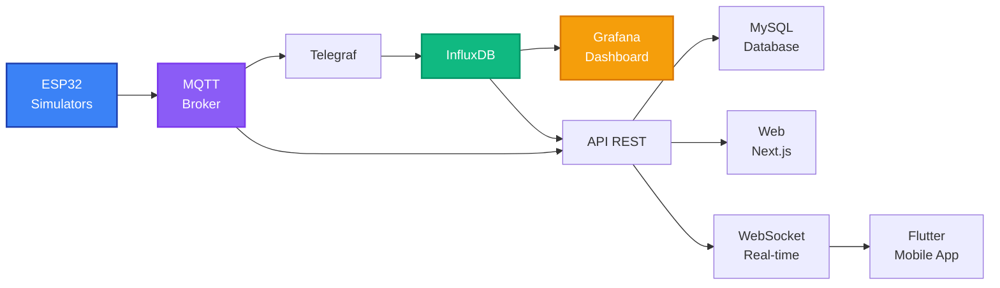

```markdown
<p align="center">
  
</p>

# Proyecto medusse iot

## Vision general
Ecosistema iot completo de monitoreo ambiental estructurado bajo una arquitectura de microservicios distribuidos. El sistema esta disenado para realizar la recopilacion, procesamiento, almacenamiento y visualizacion de datos en tiempo real, ofreciendo un pipeline de datos optimizado y preparado para una migracion directa a hardware real mediante tecnologia LoRa Mesh.

---

## Arquitectura del sistema
El ecosistema se divide de forma modular en componentes independientes contenedorizados para garantizar la alta disponibilidad y escalabilidad del entorno:



* **Capa iot**: Nodos simulados encargados de transmitir telemetria realista en tiempo real desde 4 ubicaciones estrategicas del centro.
* **Capa de mensajeria**: Broker Mosquitto MQTT que centraliza la recepcion de la informacion de los sensores de manera asincrona.
* **Capa de procesamiento**: Pipeline de datos controlado por Telegraf que realiza una ingesta de datos continua y limpia hacia el motor temporal.
* **Capa de persistencia**: Arquitectura hibrida que separa la telemetria analitica del almacenamiento de control de negocio.
* **Capa de negocio**: API REST modular encargada de centralizar la autenticacion, logs de auditoria y la gestion de alertas.
* **Capa de presentacion**: Clientes sincronizados de consumo multiplataforma que incluyen dashboard analitico, aplicacion web y aplicacion movil nativa.

---

## Persistencia doble avanzada

El nucleo del almacenamiento destaca por una separacion de responsabilidades orientada a maximizar el rendimiento del sistema:

* **Persistencia temporal**: Uso de InfluxDB para almacenar las series temporales de telemetria de alta frecuencia generadas por los 18 sensores.
* **Persistencia relacional**: Diseno en MySQL compuesto por 9 tablas para la administracion de usuarios, roles, historico de alertas y control de sesiones activas por tokens UUID. Incorpora 10 procedimientos almacenados para delegar la logica pesada directamente en el servidor y asegurar el control criptografico de contrasenas con bcrypt.

---

## Catalogo de sensores y ubicaciones

El sistema administra la monitorizacion automatica de 18 variables simultaneas repartidas en 4 zonas de control especificas (aula 20, aula 21, gimnasio y laboratorio):

| Categoria | Metricas disponibles |
| --- | --- |
| **Ambiental** | Temperatura, humedad, co2, presion atmosferica, voc, iaq. |
| **Agua** | Humedad del suelo, nivel de ph, flujo de agua, tds, oxigeno disuelto. |
| **Energia** | Voltaje de bateria, voltaje solar, porcentaje de bateria, consumo de energia. |
| **Control** | Estado de carga, modo bajo consumo, contador de wake-ups. |

---

## Cumplimiento de los 16 retos del tfg

El proyecto cubre e implementa con exito la totalidad de los objetivos planteados en los criterios de evaluacion de la titulacion academica:

| Reto | Descripcion tecnica del logro | Estado |
| --- | --- | --- |
| **Reto 1** | Proyecto de sostenibilidad enfocado en 5 ODS con calculo de impacto mediante 15 KPIs. | Completado |
| **Reto 2** | Persistencia hibrida unificando el motor InfluxDB 2.7 con la base de datos MySQL 8.0. | Completado |
| **Reto 3** | Creacion de 10 procedimientos almacenados encargados de la logica interna de negocio. | Completado |
| **Reto 4** | Planificacion detallada de bocetos estructurales de componentes y mockups de interfaces. | Completado |
| **Reto 5** | Maquetacion avanzada de componentes visuales interactivos utilizando HTML y CSS modular. | Completado |
| **Reto 6** | Plan de empresa detallado con definicion de 3 planes comerciales y proyecciones de viabilidad. | Completado |
| **Reto 7** | Validaciones asincronas de formularios en tiempo real controladas en el lado del cliente. | Completado |
| **Reto 8** | Desarrollo completo de la arquitectura del API REST para la transferencia segura de datos. | Completado |
| **Reto 9** | Autenticacion robusta con control de sesiones privadas y uso de hashing criptografico. | Completado |
| **Reto 10** | Panel de administracion centralizado con control total de mantenimiento, usuarios y logs. | Completado |
| **Reto 11** | Modulo automatizado de despliegue continuo e integracion en plataformas de hosting en la nube. | Completado |
| **Reto 12** | Sincronizacion asincrona bidireccional basada en Fetch API y transmision por WebSocket. | Completado |
| **Reto 13** | Implementacion de soluciones cliente multiplataforma mediante entornos de desarrollo modernos. | Completado |
| **Reto 14** | Diseno web responsivo de alta fidelidad con microanimaciones fluidas para la experiencia de usuario. | Completado |
| **Reto 15** | Estructura modular del lado del servidor basada en Express y controlada con Docker Compose. | Completado |
| **Reto 16** | Redaccion de la documentacion final estructurada con mas de 7,000 lineas de desglose analitico. | Completado |

---

## Stack tecnologico

* **Backend**: Node.js, Express, Python.
* **Bases de datos**: InfluxDB 2.7, MySQL 8.0.
* **Mensajeria y protocolos**: MQTT (Mosquitto 2.0), WebSocket, HTTP REST.
* **Frontend web**: Next.js 16, React 19, TypeScript, Tailwind CSS, Framer Motion.
* **Aplicacion movil**: Flutter, Dart (arquitectura de estado Provider).
* **Orquestacion**: Docker, Docker Compose.

---

## Capturas de pantalla

1. Interfaz de usuario principal

2. Secciones informativas avanzadas

1. Monitoreo analitico de ubicaciones

1. Paneles dinamicos y graficos de series temporales

---

## Informacion de contacto

Francisco Manuel Lopez Alarte

Email: pacoaldev@gmail.com

Sitio web: https://www.pacoal.dev

```

```