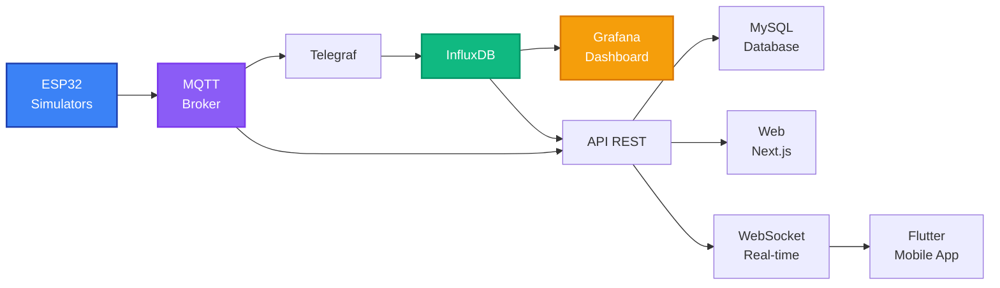

# Documentación general del proyecto - Medusse IoT

**Sistema IoT de monitoreo ambiental con arquitectura de microservicios**

Documento unificado de presentación del TFG: resume el proyecto, integra los 16 retos y concentra la información útil para evaluación y exposición.

---

## Información del proyecto

**Título:** Sistema IoT de monitoreo ambiental con arquitectura de microservicios  
**Autor:** Francisco Manuel López Alarte  
**Email:** pacoaldev@gmail.com  
**Institución:** IES José Rodrigo Botet  
**Curso Académico:** 2025/2026  
**Versión:** 2.7.9  
**Fecha:** Noviembre 2025  
**Licencia:** All Rights Reserved  
**Estado:** 16/16 Retos Completados (100%) ✅

---

## Resumen ejecutivo

Medusse IoT es un ecosistema completo de monitoreo ambiental que integra hardware ESP32, comunicación MQTT, bases de datos de series temporales, visualización profesional y aplicaciones cliente multiplataforma. El sistema monitorea 18 tipos de sensores distribuidos en 4 ubicaciones, proporcionando datos en tiempo real a través de múltiples interfaces: dashboard Grafana, API REST, aplicación web Next.js y aplicación móvil Flutter.

El proyecto demuestra la implementación práctica de una arquitectura de microservicios moderna, con énfasis en escalabilidad, rendimiento y preparación para despliegue en hardware real con comunicación LoRa Mesh.

---

## Arquitectura del sistema

### Diagrama de arquitectura

### Componentes principales

1. **Capa de Sensores (IoT Layer)**
   - 4 nodos ESP32 simulados (preparados para hardware real)
   - 18 tipos de sensores por ubicacion
   - Publicacion MQTT cada 15 segundos

2. **Capa de Comunicación (Message Broker)**
   - Mosquitto MQTT 2.0
   - Puerto 1883 (MQTT) y 9001 (WebSocket)
   - Topics estructurados: `iescelia/{ubicacion}/{sensor}`

3. **Capa de Procesamiento (Data Pipeline)**
   - Telegraf 1.28 con configuración optimizada
   - Parsing de JSON y agregación temporal
   - Pipeline sin pérdidas con retry automático

4. **Capa de Almacenamiento (Data Storage)**
   - InfluxDB 2.7 para series temporales
   - MySQL 8.0 para usuarios y configuración
   - Volúmenes Docker persistentes

5. **Capa de Visualización (Presentation Layer)**
   - Grafana 10.2.0 con dashboard personalizado
   - Web Next.js 16 con TypeScript
   - App Flutter multiplataforma

6. **Capa de API (Application Layer)**
   - Node.js + Express 4.18.2
   - WebSocket para streaming en tiempo real
   - Sistema de autenticación con sesiones

---

## Ubicaciones y Sensores Monitoreados

### Ubicaciones

El sistema monitorea 4 ubicaciones diferentes, cada una con características térmicas específicas:

1. **Aula 20** - Nodo ESP32_NODE_01
   - Temperatura base: 22°C
   - Color identificativo: Rojo (#E53E3E)

2. **Aula 21** - Nodo ESP32_NODE_02
   - Temperatura base: 24°C
   - Color identificativo: Púrpura (#805AD5)

3. **Gimnasio** - Nodo ESP32_NODE_03
   - Temperatura base: 23°C
   - Color identificativo: Naranja (#FF9800)

4. **Laboratorio** - Nodo ESP32_NODE_04
   - Temperatura base: 21°C
   - Color identificativo: Verde (#38A169)

### Sensores Implementados (18 tipos)

#### Sensores Ambientales
- **Temperatura** (°C) - Sensor DHT22
- **Humedad** (%) - Sensor DHT22
- **CO2** (ppm) - Sensor de gas MQ-135
- **Presión atmosférica** (hPa) - Sensor BME680
- **VOC** (ppb) - Compuestos Orgánicos Volátiles - BME680
- **IAQ** (índice) - Calidad del Aire Interior - BME680

#### Sensores de Calidad de Agua y Suelo
- **Humedad del suelo** (%) - Sensor capacitivo
- **pH** (nivel) - Sensor de pH para agua
- **Flujo de agua** (L/min) - Sensor YF-S201
- **TDS** (ppm) - Sólidos Disueltos Totales
- **Oxígeno disuelto** (mg/L) - Sensor DO

#### Sistema de Energía Solar (Fase 2)
- **Voltaje de batería** (V) - Rango 3.2-4.2V
- **Voltaje solar** (V) - Panel 18.5V max
- **Porcentaje de batería** (%) - 0-100%
- **Consumo de energía** (mA) - Consumo actual del nodo
- **Estado de carga** (booleano) - Cargando/No cargando
- **Modo bajo consumo** (booleano) - Activado/Desactivado
- **Contador de wake-ups** (count) - Número de despertares

---

## Stack Tecnologico

### Backend
- **Node.js** v18+ - Runtime JavaScript
- **Express** 4.18.2 - Framework web
- **Python** 3.9+ - Simulador de sensores
- **Paho MQTT** - Cliente MQTT para Python

### Bases de Datos
- **InfluxDB** 2.7 - Series temporales
- **MySQL** 8.0 - Datos relacionales
- **Telegraf** 1.28 - Pipeline de datos

### Frontend
- **Next.js** 16 - Framework React
- **TypeScript** 5 - Tipado estático
- **Tailwind CSS** 4 - Estilos
- **Framer Motion** 12 - Animaciones

### Mobile
- **Flutter** 3.9+ - Framework multiplataforma
- **Dart** - Lenguaje de programación
- **Provider** - Gestión de estado
- **fl_chart** - Gráficos interactivos

### Infraestructura
- **Docker** - Contenedorización
- **Docker Compose** - Orquestación
- **Mosquitto** 2.0 - Broker MQTT
- **Grafana** 10.2.0 - Visualización

### Comunicación
- **MQTT** - Protocolo IoT
- **WebSocket** - Tiempo real
- **HTTP REST** - API
- **JSON** - Formato de datos

---

... (archivo completo copiado)
